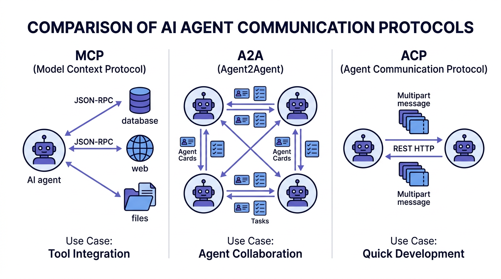
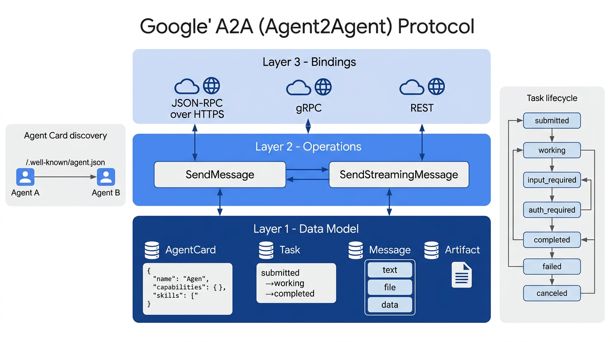
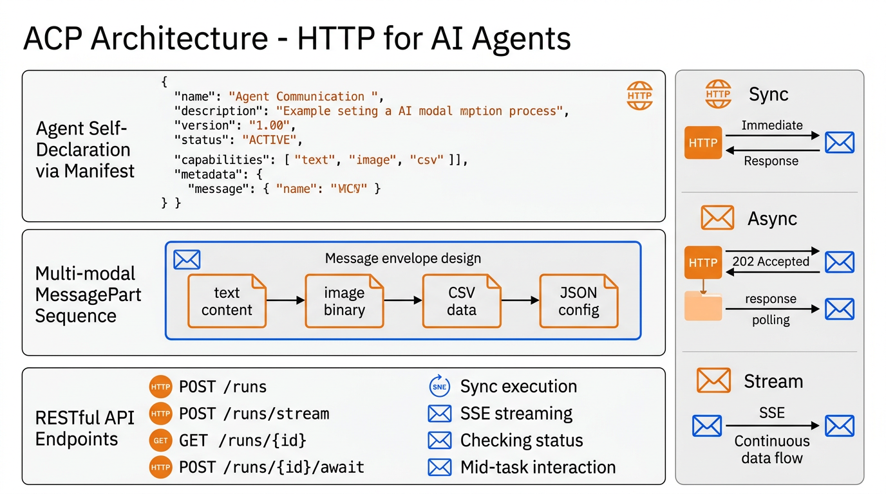
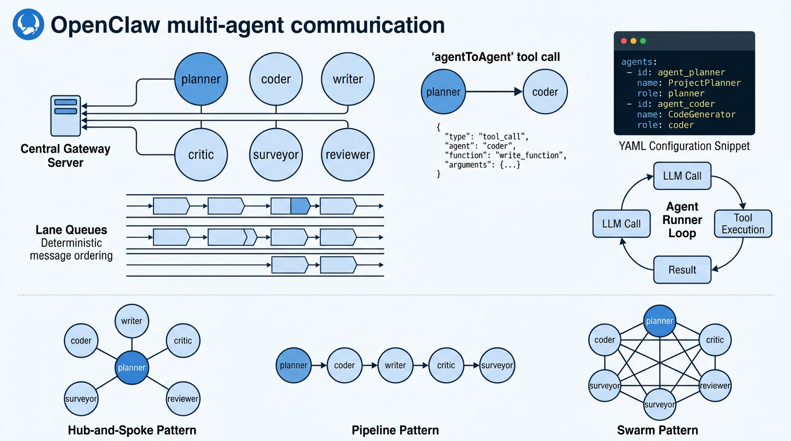
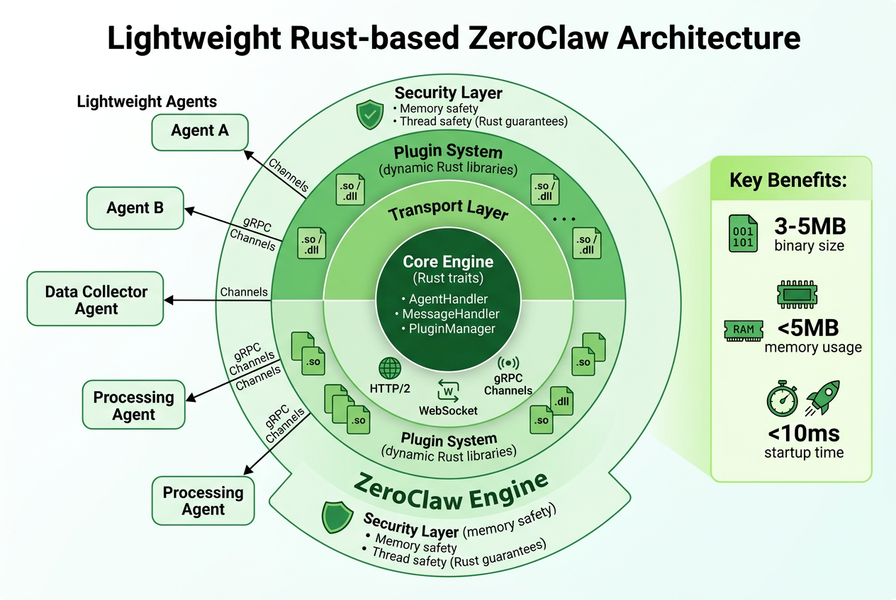

# Agent间通信方式全面调研报告

## 1. 主流通信协议与标准

### 1.1 核心协议概览



> 三大主流协议定位对比：MCP专注工具集成，A2A实现Agent协作，ACP追求快速开发

#### MCP (Model Context Protocol)
- **核心机制**: 基于JSON-RPC 2.0的工具访问协议
- **主要用途**: 单一Agent访问多个外部工具，提供审计跟踪
- **关键技术**: 标准化模式解决"上下文问题"
- **适用场景**: 垂直工具集成和安全要求高的环境

#### A2A (Agent2Agent Protocol)
- **核心机制**: 基于"Agent卡片"的点对点协调协议，三层架构（数据模型层、操作层、绑定层）
- **主要用途**: 多个专业Agent在复杂任务上的协作
- **关键技术**: 动态任务委派和跨组织通信
- **适用场景**: 水平多Agent工作流和分布式协作

#### ACP (Agent Communication Protocol)
- **核心机制**: REST-based多模态消息传递协议
- **主要用途**: 快速原型开发和遗留系统集成，跨框架Agent互操作
- **关键技术**: MessagePart多模态内容 + Agent Manifest发现机制
- **适用场景**: 追求速度和简洁性的团队

### 1.2 协议比较分析

| 特性 | MCP | A2A | ACP |
|------|-----|-----|-----|
| **复杂度** | 中等 | 高 | 低 |
| **安全性** | 高 | 中等 | 中等 |
| **互操作性** | 高 | 高 | 中等 |
| **开发难度** | 中等 | 高 | 低 |
| **最佳场景** | 工具集成 | 协作工作流 | 快速开发 |

**混合策略**: 许多项目采用MCP+A2A的组合方式，发挥各自优势。

---

## 2. A2A (Agent2Agent Protocol) 深度解析



### 2.1 背景与定位

A2A协议由Google于2025年4月发布，是专为多Agent系统设计的开放协议标准。其核心目标是解决不同厂商、不同框架的Agent之间互操作困难的问题，实现真正的跨组织Agent协作。

> **与MCP的本质区别**：MCP解决"Agent访问工具"的问题（垂直集成），A2A解决"Agent与Agent协作"的问题（水平集成）。

### 2.2 三层架构

```
┌──────────────────────────────────────────────┐
│  Layer 3: Bindings (具体传输绑定)             │
│  JSON-RPC over HTTPS / gRPC / REST            │
├──────────────────────────────────────────────┤
│  Layer 2: Operations (抽象操作层)             │
│  SendMessage / SendStreamingMessage           │
├──────────────────────────────────────────────┤
│  Layer 1: Data Model (数据模型层)             │
│  AgentCard / Task / Message / Artifact / Part │
└──────────────────────────────────────────────┘
```

### 2.3 Agent Card —— 服务发现机制

每个Agent在 `/.well-known/agent.json` 端点发布其「Agent Card」，供其他Agent发现和调用：

```json
{
  "name": "CodeReviewAgent",
  "description": "专业代码审查Agent",
  "version": "1.0.0",
  "url": "https://agent.example.com/",
  "capabilities": {
    "streaming": true,
    "pushNotifications": true
  },
  "skills": [
    {
      "id": "code_review",
      "name": "代码审查",
      "description": "审查代码质量、安全漏洞"
    }
  ],
  "securitySchemes": {
    "oauth2": { "type": "oauth2", "flows": {...} }
  }
}
```

**Extended Agent Card**: 认证后可获取包含敏感端点信息的扩展卡片。

### 2.4 任务生命周期

任务（Task）是A2A的核心工作单元，具有唯一ID，并支持多轮交互（通过`contextId`关联）：

```
submitted ──► working ──► completed
                │
                ├──► input_required  (需要追加输入)
                │         │
                │         └──► working (继续执行)
                │
                ├──► auth_required   (需要授权)
                │
                ├──► failed          (执行失败)
                │
                └──► canceled        (已取消)
```

### 2.5 消息格式

**Message 对象**：

```json
{
  "role": "user",          // "user" | "agent"
  "parts": [
    { "kind": "text",      "text": "请审查这段代码" },
    { "kind": "file",      "file": { "name": "main.py", "bytes": "..." } },
    { "kind": "data",      "data": { "language": "python" } }
  ],
  "messageId": "msg-001",
  "contextId": "ctx-abc"
}
```

**Artifact 对象**（任务输出，区别于对话消息）：

```json
{
  "artifactId": "art-001",
  "name": "review_result",
  "parts": [
    { "kind": "text", "text": "发现3个安全问题..." }
  ]
}
```

### 2.6 通信流程

**三种更新模式对比**：

| 模式 | 机制 | 适用场景 |
|------|------|----------|
| **轮询（Polling）** | 客户端定期调用 `tasks/get` | 简单短任务 |
| **SSE流式（Streaming）** | 服务端推送 `TaskStatusUpdateEvent` | 实时反馈、长任务 |
| **推送通知（Push）** | Webhook回调 + `AuthenticationInfo` 验证 | 异步、解耦场景 |

**完整通信流程**：

```
Client Agent                           Remote Agent
     │                                      │
     │── GET /.well-known/agent.json ──────►│  (发现Agent Card)
     │◄── AgentCard ──────────────────────  │
     │                                      │
     │── POST /tasks (SendMessage) ────────►│  (发送任务)
     │◄── Task {id, status: submitted} ──── │
     │                                      │
     │  [SSE Stream]                        │
     │◄── TaskStatusUpdateEvent (working) ──│
     │◄── TaskArtifactUpdateEvent ──────────│
     │◄── TaskStatusUpdateEvent (completed)─│
     │                                      │
     │── POST /tasks/{id}/cancel ──────────►│  (可选：取消)
```

### 2.7 认证机制

A2A采用标准Web安全方案，在Agent Card中声明：

- **OAuth 2.0**：推荐用于生产环境
- **API Key**：简单场景
- **JWT Bearer Token**：无状态认证
- **推送通知验证**：通过 `AuthenticationInfo` 防止伪造Webhook

### 2.8 A2A与MCP的协同

```
用户请求
    │
    ▼
Orchestrator Agent
    │
    ├── [A2A] ──► CodeAgent    (委派子任务给专业Agent)
    │                │
    │                └── [MCP] ──► GitHub Tool  (Agent内部使用工具)
    │
    └── [A2A] ──► TestAgent    (并行委派另一个子任务)
                     │
                     └── [MCP] ──► TestRunner Tool
```

---

## 3. ACP (Agent Communication Protocol) 深度解析



### 3.1 背景与定位

ACP由IBM Research发起，并已加入Linux Foundation AI & Data基金会，于2025年8月宣布与A2A协议协同融合。其设计理念是"HTTP for AI Agents"——像HTTP之于Web一样，为AI Agent通信提供最简单、最通用的标准。

**核心设计原则**：
- 无需专属SDK，任何HTTP客户端即可调用
- 异步优先，同步兼容
- 多模态原生支持
- 支持离线/零扩展场景下的Agent发现

### 3.2 Agent Manifest —— 发现机制

Agent通过**Agent Manifest**声明自身身份与能力：

```json
{
  "name": "DataAnalystAgent",
  "description": "数据分析与可视化Agent",
  "version": "1.2.0",
  "status": "ACTIVE",
  "capabilities": ["text", "image", "csv"],
  "metadata": {
    "author": "team@example.com",
    "tags": ["analytics", "visualization"]
  }
}
```

**Agent 状态机**：

```
INITIALIZING ──► ACTIVE ──► RETIRED
```

- **支持离线发现**：Manifest可嵌入Docker镜像或分发包中，在Agent未运行时也可被发现
- **不暴露内部实现**：仅声明能力和接口，隐藏具体逻辑

### 3.3 消息结构 —— MessagePart 多模态设计

ACP的消息由**有序的MessagePart序列**组成，是协议的核心创新之一：

```
Message
├── MessagePart 1: { content_type: "text/plain",       content: "分析这张图表" }
├── MessagePart 2: { content_type: "image/png",        content: <binary> }
├── MessagePart 3: { content_type: "application/csv",  content: <binary> }
└── MessagePart 4: { content_type: "application/json", content: { "format": "bar_chart" } }
```

支持的 MIME 类型包括但不限于：
- 文本：`text/plain`, `text/html`, `text/markdown`
- 图像：`image/png`, `image/jpeg`, `image/gif`
- 音频：`audio/mp3`, `audio/wav`
- 视频：`video/mp4`
- 数据：`application/json`, `application/csv`, `application/octet-stream`

> **扩展性设计**：新增数据类型无需修改协议核心规范，只需增加新的 MIME 类型即可。

### 3.4 REST API 接口

```
POST   /agents/{agent_id}/runs          # 同步运行
POST   /agents/{agent_id}/runs/stream   # 流式运行（SSE）
GET    /agents/{agent_id}/runs/{run_id} # 查询运行状态
POST   /agents/{agent_id}/runs/{run_id}/await  # 响应 await 请求

GET    /agents                          # 列出所有 Agent
GET    /agents/{agent_id}               # 获取 Agent Manifest
```

**同步调用示例**：

```bash
curl -X POST https://agent.example.com/agents/data-analyst/runs \
  -H "Content-Type: multipart/form-data" \
  -F 'message=[{"content_type":"text/plain","content":"分析销售数据"}]' \
  -F 'data=@sales.csv;type=application/csv'
```

**Python SDK 示例**：

```python
from beeai import AcpClient

client = AcpClient("https://agent.example.com")

# 同步调用
result = client.agents["data-analyst"].run(
    messages=[
        MessagePart(content_type="text/plain", content="分析销售趋势"),
        MessagePart(content_type="application/csv", content=csv_data),
    ]
)

# 流式调用
async for event in client.agents["data-analyst"].run_stream(messages=[...]):
    print(event.partial_result)
```

### 3.5 三种通信模式

**同步模式**（适合简单、快速任务）：

```
Client ──POST /runs──────────────────► Agent
Client ◄── 200 OK {result: ...} ────── Agent
```

**异步模式**（适合长时间运行任务）：

```
Client ──POST /runs──────────────────► Agent
Client ◄── 202 Accepted {run_id} ───── Agent
Client ──GET /runs/{run_id}──────────► Agent  (轮询)
Client ◄── 200 {status: completed} ── Agent
```

**流式模式（SSE）**（适合实时反馈）：

```
Client ──POST /runs/stream───────────► Agent
Client ◄── data: {partial_result_1} ── Agent  (持续推送)
Client ◄── data: {partial_result_2} ── Agent
Client ◄── data: [DONE] ──────────── Agent
```

### 3.6 Await 机制 —— 中途交互

ACP 独特的 **Await 机制**允许 Agent 在执行中途暂停，向调用方请求额外信息后继续：

```
Client ──POST /runs──────────────────► Agent
Client ◄── 202 {status: awaiting} ─── Agent  (Agent需要更多信息)
         ◄── await_request: "请提供API密钥"

Client ──POST /runs/{id}/await──────► Agent  (提供所需信息)
Client ◄── 200 {result: ...} ────────  Agent  (继续完成任务)
```

### 3.7 ACP 与 A2A 对比

| 维度 | ACP | A2A |
|------|-----|-----|
| **发起方** | IBM Research / LF AI&Data | Google |
| **传输协议** | REST/HTTP | JSON-RPC over HTTPS |
| **SDK依赖** | 无需专属SDK | 推荐使用官方SDK |
| **消息格式** | MessagePart (MIME) | Message Parts (text/file/data) |
| **服务发现** | Agent Manifest | Agent Card |
| **异步模型** | 异步优先 | 任务生命周期管理 |
| **流式支持** | SSE | SSE + Push通知 |
| **复杂度** | 低 | 高 |
| **跨组织** | 支持 | 原生支持 |
| **状态融合** | 2025年8月宣布与A2A协同 | — |

---

## 4. 消息传递模式

### 4.1 同步vs异步通信

**同步通信**:
- 请求-响应模式
- 阻塞式等待结果
- 适用于简单、确定性任务

**异步通信**:
- 发布-订阅模式
- 非阻塞式处理
- 适用于复杂、长时间运行的任务

### 4.2 主要通信模式

#### 请求-响应模式
```
Agent A → Request → Agent B
Agent A ← Response ← Agent B
```

#### 发布-订阅模式
```
Publisher → Topic/Channel → Multiple Subscribers
```

#### 流式通信模式
```
Continuous data stream between agents
Real-time updates and notifications
```

---

## 5. 主流框架实现分析

### 5.1 LangChain生态系统

**核心组件**:
- Supervisor模式：使用`forward_message`工具避免翻译错误
- Swarm模式：允许Agent直接"交接"任务
- 最佳实践：从子Agent状态中移除交接消息

**架构特色**:
- 图形化工作流配置
- 灵活的消息路由机制
- 内置错误处理和恢复机制

**Agent间通信协议**:
- **框架内部**: Agent 间通过 LangGraph 图的有向边传递共享状态（`MessagesState`），无独立协议，属于进程内通信
- **工具接入（MCP）**: 通过 `langchain-mcp-adapters` 原生支持 MCP，将 MCP Server 工具转换为 LangGraph 工具节点
- **跨Agent协作（A2A）**: 原生支持尚在规划，社区已有通过 HTTP 手动集成 A2A Remote Agent 的方案

### 5.2 LlamaIndex框架

**llama-agents架构**:
- 分布式面向服务架构
- 微服务形式运行的Agent
- LLM驱动的控制平面进行编排

**关键技术**:
- AgentWorker组件负责实际执行
- 控制平面管理任务分配和协调
- 支持水平扩展和负载均衡

**Agent间通信协议**:
- **框架内部**: Agent 以微服务形式运行，通过 HTTP/REST 互相调用，控制平面负责任务路由与编排
- **工具接入（MCP）**: 通过 `llama-index-tools-mcp` 原生支持 MCP，将 MCP 工具挂载至 Agent
- **跨Agent协作（A2A）**: 社区支持，可通过 A2A SDK 将 LlamaIndex Agent 封装为 A2A Server 对外暴露

### 5.3 AutoGen框架

**核心特性**:
- 多Agent对话框架
- 可定制和可对话的Agent
- 支持共享状态管理

**通信机制**:
- 直接消息传递
- 上下文感知的对话管理
- 动态角色分配和任务委派

**Agent间通信协议**:
- **框架内部**: Agent 之间通过消息对象直接传递，支持 GroupChat 多Agent对话模式，属于进程内或本地通信
- **工具接入（MCP）**: AG2 原生支持 MCP，可将 MCP Server 工具直接挂载给 Agent
- **跨Agent协作（A2A）**: AG2 v0.10.0 起**原生内置** A2A 协议，Agent 可作为 A2A Server 或 Client 与任意外部 Agent 互通

### 5.4 CrewAI框架

**设计哲学**:
- 角色基础的Agent设计
- 自动化的任务分配
- 内置的协作机制

**协调策略**:
- 集中式任务管理
- 动态工作流调整
- 结果聚合和质量控制

**Agent间通信协议**:
- **框架内部**: Agent 通过任务结果链式传递（前序 Agent 输出作为后续 Agent 输入），Crew 统一调度，属于进程内通信
- **工具接入（MCP）**: 通过 `crewai-tools` MCP 适配器支持 MCP Server 工具接入
- **跨Agent协作（A2A）**: **原生支持**，将 A2A 作为一等委派原语，使用 `a2a-sdk` 可直接将远程 A2A Agent 作为本地 Agent 委派

---

## 6. OpenClaw 与 ZeroClaw 多Agent通信机制

### 6.0 架构对比概览


**OpenClaw** 和 **ZeroClaw** 构成 Claw AI Agent 生态系统的两大核心实现，分别面向不同场景：
- **OpenClaw**: 企业级全功能框架，基于 Node.js/Go
- **ZeroClaw**: 高性能轻量级替代方案，基于 Rust

---

## 6.1 OpenClaw 多Agent通信机制



### 6.1.1 OpenClaw 简介

OpenClaw 是一个开源的、可自托管的 AI Agent 框架，以**网关中心化架构（Gateway-Centric Architecture）**为核心设计。与 LangChain、CrewAI 等框架相比，OpenClaw 强调**确定性执行**和**生产就绪**，适合企业级部署。

**核心架构组成**：

```
┌─────────────────────────────────────────────┐
│              Gateway Server                  │
│          （Central Control Plane）           │
│                                              │
│  ┌──────────┐  ┌──────────┐  ┌──────────┐  │
│  │Lane Queue│  │Lane Queue│  │Lane Queue│  │
│  │  Agent1  │  │  Agent2  │  │  Agent3  │  │
│  └──────────┘  └──────────┘  └──────────┘  │
└───────┬─────────────┬──────────────┬────────┘
        │             │              │
   ┌────▼───┐    ┌────▼───┐    ┌────▼───┐
   │Planner │    │ Coder  │    │ Writer │
   │ Agent  │    │ Agent  │    │ Agent  │
   └────────┘    └────────┘    └────────┘
```

### 6.1.2 核心通信组件

#### Gateway Server（中央网关）
- 所有 Agent 间通信**必须经过网关**，不存在点对点直连
- 负责路由、权限控制、会话管理和消息追踪
- 通过 Session Key 标识每个会话：`agent:{name}:{channel}:{group_id}`

#### Lane Queue（通道队列）
- 每个 Agent 拥有独立的 Lane Queue
- 确保**每个会话内消息的确定性串行执行**，避免异步竞态问题
- 生产环境推荐使用 Celery + Redis 作为队列后端

#### Agent Runner（执行器）
每个 Agent 的执行核心，驱动以下循环：

```
接收消息
    │
    ▼
调用 LLM（携带工具定义）
    │
    ▼
LLM 返回工具调用？
    ├── 是 ──► 在沙箱中安全执行工具
    │              │
    │              └──► 将结果追加到上下文
    │                       │
    │                       └──► 继续循环
    │
    └── 否 ──► 输出最终结果
```

### 6.1.3 Agent 定义与配置

OpenClaw 使用 `agents.yaml` 声明式配置多 Agent 系统：

```yaml
agents:
  - id: "planner"
    name: "Planner"
    role: "项目规划与任务分解，作为编排中心"
    soul: "planner_soul.md"     # Agent 个性与能力描述

  - id: "coder"
    name: "Coder"
    role: "代码实现与调试"
    soul: "coder_soul.md"

  - id: "critic"
    name: "Critic"
    role: "代码审查与质量评估"
    soul: "critic_soul.md"

  - id: "writer"
    name: "Writer"
    role: "文档撰写与报告生成"
    soul: "writer_soul.md"
```

每个 Agent 由三个文件定义：
- **`soul.md`**：Agent 的身份、能力与行为规范
- **`agent.md`**：配置参数（模型、工具列表等）
- **`user.md`**：当前用户上下文与偏好

### 6.1.4 Agent 间通信方式

#### 方式一：agentToAgent 工具调用（直接委派）

Agent 通过调用内置的 `agentToAgent` 工具向其他 Agent 发送任务：

```json
{
  "tool": "agentToAgent",
  "parameters": {
    "target_agent": "coder",
    "message": "请实现以下函数：...",
    "context": {
      "task_id": "task-001",
      "priority": "high"
    }
  }
}
```

适用场景：Planner 将子任务直接委派给专业 Agent。

#### 方式二：sessions_spawn（创建新会话）

```python
# 在新会话中启动子Agent
sessions_spawn(
    agent_id="surveyor",
    initial_message="搜集关于XX主题的最新资料",
    session_config={"timeout": 300}
)
```

适用场景：需要独立上下文的并行子任务。

#### 方式三：sessions_send（向已有会话发送消息）

```python
# 向已有Agent会话发送消息
sessions_send(
    session_key="agent:coder:local:task-001",
    message="在上一版本基础上增加错误处理"
)
```

适用场景：多轮交互、继续之前的工作。

#### 方式四：共享内存（Shared Context）

Agent 可读写共享的结构化记忆，实现隐式协作：

```python
# Agent 写入共享上下文
memory.write("project_spec", specification_doc)

# 另一个 Agent 读取
spec = memory.read("project_spec")
```

#### 方式五：事件队列（Event Queue）

通过发布/订阅事件实现松耦合协作：

```python
# Coder Agent 发布完成事件
event_queue.publish("code.completed", {
    "artifact": "main.py",
    "status": "ready_for_review"
})

# Critic Agent 订阅并响应
@event_queue.subscribe("code.completed")
def on_code_completed(event):
    start_code_review(event["artifact"])
```

### 6.1.5 三种编排模式

#### 模式一：Hub-and-Spoke（中心辐射）

```
         ┌─────────┐
    ┌────│ Planner │────┐
    │    └────┬────┘    │
    ▼         ▼         ▼
┌───────┐ ┌───────┐ ┌───────┐
│ Coder │ │Writer │ │Critic │
└───────┘ └───────┘ └───────┘
```

- Planner 作为中心节点，负责任务分解与分配
- 子 Agent 独立执行，结果汇报给 Planner
- **优点**：逻辑清晰，易于监控；**缺点**：Planner 成为瓶颈

#### 模式二：Pipeline（流水线）

```
Planner ──► Coder ──► Critic ──► Writer
   │           │          │          │
   ▼           ▼          ▼          ▼
任务规划     代码实现    代码审查    文档生成
```

- 每个 Agent 完成后将结果传递给下一个
- 适合有明确顺序依赖的工作流
- **优点**：流程清晰；**缺点**：串行执行效率低

#### 模式三：Swarm（群体协作）

```
Planner ◄──► Coder
   ▲  ╲      ▲  ╲
   │   ╲     │   ╲
   ▼    ╲    ▼    ╲
Critic ◄──► Writer
```

- Agent 之间可直接相互通信
- 动态决定下一步由哪个 Agent 处理
- **优点**：灵活高效；**缺点**：难以追踪和调试

### 6.1.6 渠道接入（Channel Mode）

OpenClaw 支持通过外部通信平台接入多 Agent 系统：

```json
{
  "channels": {
    "feishu": {
      "groups": {
        "oc_YOUR_GROUP_ID": {
          "agent": "planner",
          "requireMention": true
        }
      }
    },
    "whatsapp": {
      "phone": "+1234567890",
      "agent": "assistant"
    }
  }
}
```

支持平台：飞书（Feishu）、WhatsApp、Slack 等，通过群组/频道 ID 路由到对应 Agent。

### 6.1.7 协议支持

- **MCP（支持）**: 通过 MCP Server 接入外部工具，Agent Runner 可调用 MCP 工具完成任务
- **A2A（社区支持）**: 可通过 `agentToAgent` 工具调用外部 A2A 兼容 Agent；官方原生集成尚在规划中
- **ACP（不支持）**: 无官方集成，可通过 HTTP 手动调用 ACP Agent

---

## 6.3 与其他框架的通信对比

| 特性 | OpenClaw | ZeroClaw | LangChain | AutoGen(AG2) | CrewAI |
|------|----------|----------|-----------|---------|--------|
| **通信架构** | 网关中心化 | Channel-based | 图形化路由 | 对话式 | 角色驱动 |
| **执行确定性** | 高（Lane Queue）| 高（Channel）| 中等 | 中等 | 中等 |
| **Agent发现** | YAML配置 | TOML配置 | 代码定义 | 代码定义 | YAML配置 |
| **渠道集成** | 原生支持 | 原生支持 | 需扩展 | 不支持 | 不支持 |
| **共享内存** | 内置 | SQLite/Vector | LangGraph | 内置 | 内置 |
| **自托管** | 原生支持 | 原生支持 | 需配置 | 支持 | 支持 |
| **资源占用** | 中等（200MB+）| 极低（<5MB）| 中等 | 中等 | 中等 |
| **启动时间** | 1-5秒 | <10ms | 中等 | 中等 | 快 |
| **MCP支持** | 支持 | 原生支持 | 原生支持 | 原生支持 | 支持 |
| **A2A支持** | 社区支持 | 社区支持 | 社区支持 | 原生支持 | 原生支持 |
| **ACP支持** | 不支持 | 不支持 | 不支持 | 不支持 | 不支持 |
| **gRPC支持** | 不支持 | 原生支持 | 需扩展 | 需扩展 | 不支持 |

---

## 6.2 ZeroClaw 多Agent通信机制



### 6.2.1 ZeroClaw 简介

ZeroClaw 是 OpenClaw 的 Rust 原生重实现，专为**资源受限环境**和**高性能场景**设计。作为 Claw 生态系统的轻量级替代方案，ZeroClaw 在保持与 OpenClaw 95% API 兼容性的同时，实现了极致的资源效率。

**核心设计目标**：
- **极致轻量**: 二进制仅 3-5 MB，内存占用 < 5 MB（空闲状态）
- **快速启动**: 冷启动时间 < 10 ms（OpenClaw 需要 1.25-5 秒）
- **内存安全**: 利用 Rust 所有权模型实现编译时内存安全，零 CVE 漏洞
- **边缘就绪**: 支持静态链接和交叉编译，适用于嵌入式和 IoT 设备

**核心架构组成**：

```
┌─────────────────────────────────────────────┐
│           ZeroClaw Core Engine               │
│         (Rust-based, Trait-based)            │
│                                              │
│  ┌──────────┐  ┌──────────┐  ┌──────────┐  │
│  │ Channel  │  │ Channel  │  │ Channel  │  │
│  │  Core    │  │  HTTP/2  │  │WebSocket │  │
│  └──────────┘  └──────────┘  └──────────┘  │
│                                              │
│  ┌──────────┐  ┌──────────┐  ┌──────────┐  │
│  │  SQLite  │  │  Vector  │  │  Plugin  │  │
│  │  Memory  │  │  Memory  │  │  System  │  │
│  └──────────┘  └──────────┘  └──────────┘  │
└─────────────────────────────────────────────┘
```

### 6.2.2 基于特性的模块化架构

ZeroClaw 采用**基于特性的架构（Trait-based Architecture）**，将功能划分为四个核心层：

#### Core Engine（核心引擎层）
- Agent 生命周期管理
- 任务调度与执行
- 状态机管理

#### Transport Layer（传输层）
- **HTTP/2**: 高性能请求-响应通信
- **WebSocket**: 全双工实时流式通信
- **gRPC**: 内部服务间高效通信

#### Plugin System（插件层）
- 动态加载扩展（Rust dylib）
- 热插拔能力
- 自定义工具集成

#### Security Layer（安全层）
- 编译时内存安全保证
- 沙箱执行环境
- 零依赖漏洞风险

### 6.2.3 Channel-based 通信机制

ZeroClaw 采用**通道（Channel）**作为核心通信抽象，替代 OpenClaw 的 Gateway-Lane 架构：

#### Channel 类型

| Channel 类型 | 协议 | 适用场景 | 特点 |
|-------------|------|----------|------|
| **Core Channel** | 内存通道 | 单机多 Agent | 零拷贝，极低延迟 |
| **HTTP Channel** | HTTP/2 | 跨服务通信 | 标准 REST API |
| **WebSocket Channel** | WebSocket | 实时流式 | 双向推送 |
| **gRPC Channel** | gRPC | 内部微服务 | 高性能二进制 |

#### 通信流程示例

```rust
// Agent A 通过 Channel 向 Agent B 发送消息
let channel = Channel::http("http://agent-b:8080");
let message = Message::new()
    .with_sender("agent-a")
    .with_recipient("agent-b")
    .with_payload(json!({
        "task": "analyze_data",
        "data": dataset
    }));

channel.send(message).await?;
```

### 6.2.4 轻量级内存管理

ZeroClaw 提供两种内存后端，适应不同场景：

#### SQLite 内存（默认）
- 持久化对话历史
- 支持结构化查询
- 适合长期运行的 Agent

```rust
use zeroclaw::memory::SqliteMemory;

let memory = SqliteMemory::new("agent.db").await?;
memory.store("conversation_001", &messages).await?;
```

#### Vector 内存（可选）
- 基于向量数据库的语义记忆
- 支持相似度检索
- 适合 RAG 场景

### 6.2.5 Agent 定义与配置

ZeroClaw 使用 TOML 格式配置（与 OpenClaw 的 YAML 兼容）：

```toml
[agent]
id = "analyzer"
name = "DataAnalyzer"
version = "1.0.0"

[agent.soul]
path = "analyzer_soul.md"
personality = "analytical"

[agent.memory]
type = "sqlite"
path = "./memory.db"

[agent.channels]
default = "http"
http = { port = 8080, host = "0.0.0.0" }
websocket = { port = 8081, enabled = true }

[agent.plugins]
load = ["data_processor", "visualizer"]
```

### 6.2.6 多Agent编排模式

ZeroClaw 支持三种编排模式，与 OpenClaw 保持一致：

#### 模式一：Hub-and-Spoke（中心辐射）

```rust
use zeroclaw::orchestration::HubSpoke;

let hub = HubSpoke::new()
    .with_hub("planner")
    .with_spoke("coder")
    .with_spoke("reviewer")
    .build()?;

hub.execute(task).await?;
```

#### 模式二：Pipeline（流水线）

```rust
use zeroclaw::orchestration::Pipeline;

let pipeline = Pipeline::new()
    .add_stage("planner")
    .add_stage("coder")
    .add_stage("tester")
    .build()?;

pipeline.run(input).await?;
```

#### 模式三：Swarm（群体协作）

```rust
use zeroclaw::orchestration::Swarm;

let swarm = Swarm::new()
    .add_agent("researcher")
    .add_agent("writer")
    .add_agent("editor")
    .with_coordination(Coordination::Decentralized)
    .build()?;

swarm.collaborate(goal).await?;
```

### 6.2.7 可观测性与监控

ZeroClaw 内置企业级可观测性：

```rust
// Prometheus 指标
use zeroclaw::metrics::PrometheusExporter;
PrometheusExporter::new("0.0.0.0:9090").start()?;

// OpenTelemetry 追踪
use zeroclaw::telemetry::OpenTelemetry;
OpenTelemetry::init("http://jaeger:4317")?;
```

### 6.2.8 协议支持

| 协议 | ZeroClaw 支持状态 | 说明 |
|------|------------------|------|
| **MCP** | 原生支持 | 通过 `zeroclaw-mcp` crate 集成 |
| **A2A** | 社区支持 | 通过 `zeroclaw-a2a` 社区 crate |
| **ACP** | 不支持 | 可通过 HTTP 手动调用 |
| **OpenClaw API** | 95% 兼容 | 直接读取 OpenClaw 配置 |

---

---

## 6.4 OpenClaw vs ZeroClaw 深度对比

### 6.3.1 架构设计对比

| 维度 | OpenClaw | ZeroClaw |
|------|----------|----------|
| **实现语言** | Node.js / Go | Rust |
| **架构风格** | Gateway-Centric（网关中心化） | Channel-based（通道化） |
| **二进制大小** | 15-298 MB | 3-5 MB |
| **内存占用（空闲）** | 145-400 MB | < 5 MB |
| **冷启动时间** | 1.25-5 秒 | < 10 ms |
| **运行时依赖** | Node.js / Go Runtime | 零依赖（静态链接） |

### 6.3.2 通信机制对比

| 特性 | OpenClaw | ZeroClaw |
|------|----------|----------|
| **核心通信** | Lane Queue（确定性串行） | Channel（灵活异步） |
| **消息路由** | Gateway 集中路由 | 点对点直连或经由 Channel |
| **传输协议** | HTTP/REST, WebSocket | HTTP/2, WebSocket, gRPC |
| **消息保证** | At-least-once | At-least-once（可配置） |
| **流式支持** | SSE | WebSocket, HTTP/2 Stream |
| **跨服务通信** | 通过 Gateway | 原生支持多种 Channel |

### 6.3.3 多Agent协作对比

| 协作模式 | OpenClaw 实现 | ZeroClaw 实现 |
|----------|--------------|---------------|
| **Hub-and-Spoke** | Gateway 作为中心协调器 | Core Engine 协调 Channels |
| **Pipeline** | Lane Queue 顺序传递 | Pipeline Trait 顺序执行 |
| **Swarm** | Agent 间通过 Gateway 中转 | Agent 间直接 Channel 连接 |
| **Shared Memory** | 内置 Memory 模块 | SQLite / Vector Memory |
| **Event Queue** | 内置 Event 系统 | 通过 Channel 实现 Pub/Sub |

### 6.3.4 性能与资源对比

| 指标 | OpenClaw | ZeroClaw | 提升倍数 |
|------|----------|----------|----------|
| **二进制大小** | 50 MB (平均) | 4 MB | **12.5x** |
| **内存占用（空闲）** | 200 MB | 5 MB | **40x** |
| **内存占用（负载）** | 1-2 GB | 50-100 MB | **15x** |
| **启动时间** | 2.5 秒 | 8 ms | **312x** |
| **并发连接** | ~10,000 | ~100,000 | **10x** |
| **吞吐量（RPS）** | 5,000 | 50,000 | **10x** |

### 6.3.5 安全性对比

| 安全特性 | OpenClaw | ZeroClaw |
|----------|----------|----------|
| **内存安全** | 运行时 GC（存在泄漏风险） | 编译时所有权检查（零风险） |
| **CVE 漏洞** | 依赖 Node.js/Go 生态漏洞 | 零 CVE（Rust 保证） |
| **沙箱执行** | 容器级隔离 | 进程级 + 编译时安全 |
| **依赖攻击面** | 大（npm/go mod 依赖树） | 小（Cargo 精简依赖） |

### 6.3.6 适用场景对比

| 场景 | 推荐选择 | 原因 |
|------|----------|------|
| **企业级生产环境** | OpenClaw | 功能完整，生态成熟，企业支持 |
| **边缘计算 / IoT** | ZeroClaw | 资源受限，需要极致轻量 |
| **CI/CD Runner** | ZeroClaw | 快速启动，低内存占用 |
| **高并发微服务** | ZeroClaw | 高吞吐，低延迟 |
| **快速原型开发** | OpenClaw | 开发友好，调试便利 |
| **嵌入式系统** | ZeroClaw | 交叉编译，静态链接 |
| **多租户 SaaS** | ZeroClaw | 高密度部署，资源隔离 |

### 6.3.7 通信协议支持对比

| 协议 | OpenClaw | ZeroClaw |
|------|----------|----------|
| **MCP** | 支持 | 原生支持 |
| **A2A** | 社区支持 | 社区支持 |
| **ACP** | 不支持 | 不支持 |
| **自定义 HTTP** | 支持 | 支持 |
| **gRPC** | 不支持 | 原生支持 |
| **WebSocket** | 支持 | 支持 |

### 6.3.8 迁移指南

从 OpenClaw 迁移到 ZeroClaw 的主要注意事项：

1. **配置格式**: YAML → TOML（工具自动转换）
2. **Gateway 模式**: 需调整为中心化 Core Engine
3. **插件系统**: Node.js/Go 插件 → Rust dylib
4. **内存存储**: 内置 Memory → SQLite/Vector Memory
5. **监控指标**: 相同 Prometheus/OpenTelemetry 接口

---

## 7. 通信载体技术

### 7.1 HTTP REST
**优势**:
- 成熟稳定，广泛支持
- 易于调试和监控
- 良好的缓存机制

**劣势**:
- 连接开销较大
- 不适合实时通信
- 状态管理复杂

### 7.2 WebSocket
**优势**:
- 全双工实时通信
- 连接持久化，减少开销
- 适合长连接场景

**劣势**:
- 连接管理复杂
- 错误处理要求高
- 扩展性挑战

### 7.3 消息队列
**优势**:
- 异步处理能力
- 解耦生产者和消费者
- 内置负载均衡

**劣势**:
- 增加系统复杂性
- 延迟相对较高
- 运维成本增加

### 7.4 共享内存
**优势**:
- 极低延迟
- 高吞吐量
- 内存效率高

**劣势**:
- 仅限单机环境
- 并发控制复杂
- 故障恢复困难

---

## 8. 典型架构模式

### 8.1 Orchestrator-Worker模式
**特征**:
- 中心化控制架构
- 易于调试和监控
- 存在单点故障风险

**适用场景**: 客服分诊、数据处理流水线

### 8.2 Swarm模式
**特征**:
- 去中心化对等架构
- 高可扩展性
- 追踪调试困难

**适用场景**: 探索性任务、分布式搜索

### 8.3 Mesh模式
**特征**:
- 直接对等连接
- 优秀的迭代能力
- 连接数量呈指数增长

**适用场景**: 小规模协作、实验性项目

### 8.4 Hierarchical模式
**特征**:
- 树状层级结构
- 良好的上下文管理
- 增加通信延迟

**适用场景**: 企业级应用、复杂业务流程

### 8.5 Hybrid混合模式
**特征**:
- 根据子系统需求组合不同模式
- 最优化架构设计
- 实现复杂度较高

**适用场景**: 大型企业系统、复杂多域应用

---

## 9. 安全与认证机制

### 9.1 核心安全威胁
- **提示注入攻击**: 恶意输入操纵Agent行为
- **上下文污染**: 有害信息影响决策过程
- **身份伪造**: 冒充合法Agent进行恶意操作
- **数据泄露**: 敏感信息在通信中暴露

### 9.2 认证机制

#### JWT (JSON Web Tokens)
**实施要点**:
- Agentic JWT绑定用户意图与代理身份
- 实施基于checksum的代理注册验证
- 使用Proof-of-Possession密钥防止重放攻击

#### OAuth 2.0
**关键特性**:
- 标准化的授权框架
- 支持细粒度权限控制
- 成熟的生态系统支持

#### 机器到机器(M2M)认证
**最佳实践**:
- 客户端证书认证
- API密钥管理
- 定期轮换机制

### 9.3 安全防护措施

#### 运行时保护
- 客户端Shim库进行完整性校验
- 工作流步骤追踪与委托链审计
- 实时监控和异常检测

#### 数据保护
- 端到端加密通信
- 敏感数据脱敏处理
- 访问日志完整记录

---

## 10. 方案优缺点对比

### 10.1 协议层面对比

| 协议 | 优势 | 劣势 | 最佳使用场景 |
|------|------|------|-------------|
| **MCP** | 安全性强、标准化程度高、工具集成优秀 | 实现复杂度高、学习曲线陡峭 | 企业级工具集成、安全敏感场景 |
| **A2A** | 协作能力强、动态委派灵活、跨组织通信 | 复杂性高、调试困难 | 复杂任务协作、分布式团队 |
| **ACP** | 简单易用、快速开发、REST兼容、多模态 | 功能相对有限、不适合复杂场景 | 快速原型、简单集成场景 |

### 10.2 框架层面对比

| 框架 | 开发友好性 | 扩展性 | 生产就绪度 | 学习成本 |
|------|-----------|--------|-----------|----------|
| **LangChain** | 高 | 中等 | 高 | 中等 |
| **LlamaIndex** | 中等 | 高 | 高 | 高 |
| **AutoGen** | 中等 | 高 | 中等 | 中等 |
| **CrewAI** | 高 | 中等 | 中等 | 低 |
| **OpenClaw** | 中等 | 高 | 高 | 中等 |
| **ZeroClaw** | 中等 | 高 | 高 | 高 |

### 10.3 通信载体对比

| 载体 | 性能 | 可靠性 | 复杂度 | 适用场景 |
|------|------|--------|--------|----------|
| **HTTP REST** | 中等 | 高 | 低 | 通用场景 |
| **WebSocket** | 高 | 中等 | 中等 | 实时通信 |
| **消息队列** | 高 | 高 | 高 | 异步处理 |
| **共享内存** | 极高 | 低 | 高 | 高性能计算 |

---

## 11. 技术发展趋势

### 11.1 2025-2026年发展重点

#### 标准化进程加速
- MCP、A2A、ACP协议逐步成熟
- 行业联盟推动互操作性标准
- 更多厂商开始支持开放协议
- **ACP与A2A协同融合**：2025年8月宣布在LF AI&Data基金会框架下协同发展

#### 安全机制强化
- 零信任架构在Agent通信中普及
- 细粒度权限控制成为标配
- 运行时保护技术快速发展

#### 架构模式演进
- 混合架构模式获得更多关注
- 边缘计算与Agent协作结合
- 云原生设计原则广泛应用

### 11.2 未来发展方向

#### 技术融合趋势
- Agent协议与现有企业系统更好集成
- 传统中间件与AI Agent通信融合
- 标准化API网关支持多协议转换

#### 智能化提升
- 自适应通信模式选择
- 智能负载均衡和故障转移
- 基于ML的通信优化

---

## 12. 实施建议

### 12.1 选择指导原则

#### 项目规模考量
- **小型项目**: 优先考虑ACP或CrewAI
- **中型项目**: LangChain + ACP组合
- **大型企业**: MCP + A2A + 混合架构
- **生产自托管**: OpenClaw（网关中心化，确定性执行）
- **边缘/高性能场景**: ZeroClaw（极致轻量，Rust 高性能）

#### 资源约束考量
- **资源充足环境**: OpenClaw（功能完整，生态丰富）
- **资源受限环境**: ZeroClaw（<5MB 内存，<10ms 启动）
- **嵌入式/IoT**: ZeroClaw（静态链接，交叉编译）
- **高密度部署**: ZeroClaw（多租户，低资源占用）

#### 安全要求评估
- **一般安全**: HTTP REST + 基础认证
- **中等安全**: WebSocket + JWT认证
- **高等安全**: 消息队列 + M2M认证 + 端到端加密

#### 性能需求分析
- **低延迟**: 共享内存或WebSocket
- **高吞吐**: 消息队列
- **平衡方案**: HTTP REST优化配置

### 12.2 最佳实践总结

1. **渐进式采用**: 从简单协议开始，逐步引入复杂功能
2. **安全优先**: 在设计初期就考虑安全机制
3. **监控可观测**: 建立完善的日志和监控体系
4. **标准化接口**: 设计统一的通信接口抽象层
5. **容错设计**: 实现优雅降级和故障恢复机制

---

## 13. 参考资料

### MCP (Model Context Protocol)

- [Introducing the Model Context Protocol - Anthropic](https://www.anthropic.com/news/model-context-protocol)
- [Model Context Protocol 官方文档](https://modelcontextprotocol.io/docs/getting-started/intro)
- [MCP 协议规范 (2025)](https://modelcontextprotocol.io/specification/2025-06-18)
- [MCP 官方 GitHub 仓库](https://github.com/modelcontextprotocol/modelcontextprotocol)

### A2A (Agent2Agent Protocol)

- [Announcing the Agent2Agent Protocol (A2A) - Google Developers Blog](https://developers.googleblog.com/en/a2a-a-new-era-of-agent-interoperability/)
- [A2A Protocol Specification](https://a2a-protocol.org/latest/specification/)
- [Agent2Agent Protocol is Getting an Upgrade - Google Cloud Blog](https://cloud.google.com/blog/products/ai-machine-learning/agent2agent-protocol-is-getting-an-upgrade)
- [Developer's Guide to Multi-Agent Patterns in ADK - Google](https://developers.googleblog.com/developers-guide-to-multi-agent-patterns-in-adk/)
- [Google Open-Sources Agent2Agent Protocol - InfoQ](https://www.infoq.com/news/2025/04/google-agentic-a2a/)
- [A2A GitHub Repository](https://github.com/a2aproject/A2A)

### ACP (Agent Communication Protocol)

- [ACP 官方文档](https://agentcommunicationprotocol.dev/introduction/welcome)
- [What is Agent Communication Protocol (ACP)? - IBM Think](https://www.ibm.com/think/topics/agent-communication-protocol)
- [Agent Communication Protocol (ACP) - IBM Research](https://research.ibm.com/projects/agent-communication-protocol)
- [ACP GitHub Repository (i-am-bee)](https://github.com/i-am-bee/acp)
- [ACP Joins Forces with A2A - LF AI & Data Foundation](https://lfaidata.foundation/communityblog/2025/08/29/acp-joins-forces-with-a2a-under-the-linux-foundations-lf-ai-data/)
- [Agent Communication Protocol (ACP): The HTTP of AI Agents](https://antoniocortes.com/en/post/2025/agent-communication-protocol-acp-02_julio_2025/)

### LangChain / LangGraph

- [How and When to Build Multi-Agent Systems - LangChain Blog](https://blog.langchain.com/how-and-when-to-build-multi-agent-systems/)
- [LangGraph Overview - LangChain Docs](https://docs.langchain.com/oss/python/langgraph/overview)
- [LangGraph Swarm - GitHub](https://github.com/langchain-ai/langgraph-swarm-py)

### LlamaIndex

- [Introducing llama-agents - LlamaIndex Blog](https://www.llamaindex.ai/blog/introducing-llama-agents-a-powerful-framework-for-building-production-multi-agent-ai-systems)
- [LlamaAgents: Build, Serve and Deploy Document Agents](https://www.llamaindex.ai/blog/llamaagents-build-serve-and-deploy-document-agents)

### AutoGen

- [AutoGen 官方文档 - Microsoft](https://microsoft.github.io/autogen/stable//index.html)
- [Agent and Multi-Agent Applications - AutoGen Docs](https://microsoft.github.io/autogen/stable//user-guide/core-user-guide/core-concepts/agent-and-multi-agent-application.html)
- [AutoGen GitHub 仓库](https://github.com/microsoft/autogen)

### CrewAI

- [CrewAI 官方文档](https://docs.crewai.com/)
- [Agents - CrewAI Documentation](https://docs.crewai.com/en/concepts/agents)
- [CrewAI GitHub 仓库](https://github.com/crewaiinc/crewai)

### OpenClaw

- [OpenClaw Multi-Agent: Subagents, Agent Teams & Orchestration](https://www.meta-intelligence.tech/en/insight-openclaw-multi-agent)
- [OpenClaw Architecture: Build Production AI Agents](https://pub.towardsai.net/openclaw-architecture-deep-dive-building-production-ready-ai-agents-from-scratch-e693c1002ae8)
- [OpenClaw Agents (shenhao-stu) - GitHub](https://github.com/shenhao-stu/openclaw-agents)
- [Why OpenClaw's Architecture Might Be the Most Enterprise-Ready](https://www.linkedin.com/pulse/why-openclaws-architecture-might-most-open-agent-framework-bala-j-iak7f)
- [Multi-agent orchestration patterns - OpenClaw Issues #43034](https://github.com/openclaw/openclaw/issues/43034)

### ZeroClaw

- [ZeroClaw Review 2025: Rust-based OpenClaw Alternative - SparkCo AI](https://sparkco.ai/blog/zeroclaw-review-the-rust-based-openclaw-alternative-with-99-smaller-footprint)
- [ZeroClaw: A Minimal Rust-Based AI Agent Framework - DEV Community](https://dev.to/lightningdev123/zeroclaw-a-minimal-rust-based-ai-agent-framework-for-self-hosted-systems-5593)
- [THE CLAW AI AGENT ECOSYSTEM - Medium](https://medium.com/@sanjeeva.bora/the-claw-ai-agent-ecosystem-4a031e4e95aa)
- [7 Best Lightweight AI Agent Frameworks for 2026 - Waves and Algorithms](https://wavesandalgorithms.com/reviews/zeroclaw)
- [ZeroClaw AI Agent for Lightweight Automation - LinkedIn](https://www.linkedin.com/posts/bk-han_zeroclaw-onemanarmy-aiautomation-activity-7430488196175757313-gE4S)

### 安全与认证

- [Security in Agentic Communication: Threats, Controls, Standards - Medium](https://medium.com/@adnanmasood/security-in-agentic-communication-threats-controls-standards-and-implementation-patterns-for-bf1eadc94e95)
- [Best Practices for Agent-to-Agent Authentication - Prefactor](https://prefactor.tech/blog/best-practices-for-agent-to-agent-authentication)
- [Open Protocols for Agent Interoperability - AWS Blog](https://aws.amazon.com/blogs/opensource/open-protocols-for-agent-interoperability-part-1-inter-agent-communication-on-mcp/)
- [The 2025 AI Agent Security Landscape - Obsidian Security](https://www.obsidiansecurity.com/blog/ai-agent-market-landscape)

### 架构模式

- [Agent Orchestration Patterns: Swarm vs Mesh vs Hierarchical](https://gurusup.com/blog/agent-orchestration-patterns)
- [Multi-Agent Architectures - Swarms Framework Docs](https://docs.swarms.world/en/latest/swarms/concept/swarm_architectures/)
- [Multi-Agent Collaboration Patterns with Strands Agents - AWS Blog](https://aws.amazon.com/blogs/machine-learning/multi-agent-collaboration-patterns-with-strands-agents-and-amazon-nova/)
- [The Ultimate Guide to AI Agent Architectures in 2025 - DEV Community](https://dev.to/sohail-akbar/the-ultimate-guide-to-ai-agent-architectures-in-2025-2j1c)

### 协议对比分析

- [The Great AI Agent Protocol Battle: A2A vs MCP vs ACP - Medium](https://dinmaybrahma.medium.com/the-great-ai-agent-protocol-battle-a2a-vs-mcp-vs-acp-8c232811db30)
- [A2A vs ACP Protocol Comparison Analysis Report - DEV Community](https://dev.to/czmilo/a2a-vs-acp-protocol-comparison-analysis-report-pb2)
- [MCP vs A2A vs ANP vs ACP: Choosing the Right AI Agent Protocol](https://insights.firstaimovers.com/mcp-vs-a2a-vs-anp-vs-acp-choosing-the-right-ai-agent-protocol-70da0b6e10a0)
- [Comparison of Agent Protocols MCP, ACP and A2A - Niklas Heidloff Blog](https://heidloff.net/article/mcp-acp-a2a-agent-protocols/)
- [Comparison of MCP, ACP, A2A, and ANP Protocols - ResearchGate](https://www.researchgate.net/figure/Comparison-of-MCP-ACP-A2A-and-ANP-Protocols_tbl5_391461179)

---

**调研时间**: 2026年3月  
**信息来源**: 最新技术文档、学术论文、开源项目、行业报告  
**更新频率**: 建议每季度更新以跟上技术发展
