# 

## 目录

- [冰箱](#冰箱)

- [任何冰箱使用疑问](#任何冰箱使用疑问)

- [请扫描左侧二维码](#请扫描左侧二维码)

  - [使用手册](#使用手册)

- [目录](#目录)

- [安全信息](#安全信息)

    - [安全说明须知](#安全说明须知)

    - [∙](#)

    - [本手册中的警告和安全说明并不能涵盖所有可能发生的条件和情况。](#本手册中的警告和安全说明并不能涵盖所有可能发生的条件和情况)

    - [您在安装、维护和操作设备时必须运用生活常识谨慎操作。](#您在安装维护和操作设备时必须运用生活常识谨慎操作)

    - [由于以下操作说明涉及各种型号，您冰箱的具体特性可能与本手册的](#由于以下操作说明涉及各种型号您冰箱的具体特性可能与本手册的)

    - [介绍略有出入，不是所有警告标志都适用。如有任何问题或顾虑，](#介绍略有出入不是所有警告标志都适用如有任何问题或顾虑)

    - [请联系最近的服务中心或登录](#请联系最近的服务中心或登录)

    - [www.samsung.com](#wwwsamsungcom)

    - [在线寻找帮助和](#在线寻找帮助和)

    - [信息。](#信息)

    - [年满](#年满)

    - [8](#8)

    - [岁以上的儿童，以及肢体不健全、感觉或精神上有障碍或缺](#岁以上的儿童以及肢体不健全感觉或精神上有障碍或缺)

    - [乏相关经验和知识的人，在有人对其进行监督或提供相关安全使用指](#乏相关经验和知识的人在有人对其进行监督或提供相关安全使用指)

    - [导，并充分了解相关危险的情况下，才可以使用本设备。](#导并充分了解相关危险的情况下才可以使用本设备)

    - [-](#)

    - [禁止儿童摆弄本设备。儿童在没有监督的情况下不得清洁和维护](#禁止儿童摆弄本设备儿童在没有监督的情况下不得清洁和维护)

    - [本设备。](#本设备)

    - [使用](#使用)

    - [R-600a](#r-600a)

    - [或](#或)

    - [R-134a](#r-134a)

    - [作为制冷剂。检查设备背面的压缩机标](#作为制冷剂检查设备背面的压缩机标)

    - [签，或者冰箱的铭牌，查看您的设备使用的制冷剂。如果此产品含有](#签或者冰箱的铭牌查看您的设备使用的制冷剂如果此产品含有)

    - [可燃气体（制冷剂](#可燃气体制冷剂)

    - [），请联系当地有关机关了解此产品的安](#请联系当地有关机关了解此产品的安)

    - [全处置方法。](#全处置方法)

    - [为了避免在制冷回路发生泄漏时产生可燃气体-空气的混合物，需要](#为了避免在制冷回路发生泄漏时产生可燃气体-空气的混合物需要)

    - [根据使用的制冷剂数量选择放置冰箱的房间空间大小。](#根据使用的制冷剂数量选择放置冰箱的房间空间大小)

    - [如果设备出现任何损坏迹象，请勿启动。如有疑问，请咨询经销商。](#如果设备出现任何损坏迹象请勿启动如有疑问请咨询经销商)

    - [设备内每含有](#设备内每含有)

    - [8 g R-600a](#8-g-r-600a)

    - [制冷剂，房间大小必须增加](#制冷剂房间大小必须增加)

    - [1 m](#1-m)

    - [。](#)

    - [具体设备中的制冷剂量显示在设备的铭牌上。](#具体设备中的制冷剂量显示在设备的铭牌上)

    - [管路制冷剂泄漏可能导致着火或眼睛受伤。如果管路制冷剂泄漏，请](#管路制冷剂泄漏可能导致着火或眼睛受伤如果管路制冷剂泄漏请)

    - [避开任何明火，移走冰箱附近任何可燃物，立刻给房间通风。](#避开任何明火移走冰箱附近任何可燃物立刻给房间通风)

    - [否则可能会导致火灾或爆炸。](#否则可能会导致火灾或爆炸)

    - [重要安全标志和注意事项：](#重要安全标志和注意事项)

    - [请遵从本手册中所有的安全指示。本手册使用以下的安全符号说明。](#请遵从本手册中所有的安全指示本手册使用以下的安全符号说明)

    - [警告](#警告)

    - [危险或不安全的做法，可能导致严重的人身伤害、财产损失或死亡。](#危险或不安全的做法可能导致严重的人身伤害财产损失或死亡)

    - [警示](#警示)

    - [危险或不安全的做法，可能导致严重的人身伤害和/或财产损坏。](#危险或不安全的做法可能导致严重的人身伤害和或财产损坏)

    - [注意](#注意)

    - [可帮助用户了解冰箱并获益于冰箱的有用信息。](#可帮助用户了解冰箱并获益于冰箱的有用信息)

    - [这些警告标志用于防止您和其他人受到伤害。](#这些警告标志用于防止您和其他人受到伤害)

    - [请严格遵守上述说明。](#请严格遵守上述说明)

    - [阅读本部分之后，请将其妥善保管，以备将来参考。](#阅读本部分之后请将其妥善保管以备将来参考)

    - [重要安全注意事项](#重要安全注意事项)

    - [警告：火灾危险](#警告火灾危险)

    - [/](#)

    - [可燃材料](#可燃材料)

    - [放置设备时，确保电源线未卡住或损坏。](#放置设备时确保电源线未卡住或损坏)

    - [不得在设备背后放置多个可移动接线板或可移动电源。](#不得在设备背后放置多个可移动接线板或可移动电源)

    - [必须注入可饮用水。](#必须注入可饮用水)

    - [保持设备机壳或内置结构的通风口无任何阻碍。](#保持设备机壳或内置结构的通风口无任何阻碍)

    - [除制造商建议的措施外，请勿使用机械设备或任何其他措施加速除霜](#除制造商建议的措施外请勿使用机械设备或任何其他措施加速除霜)

    - [过程。](#过程)

    - [请勿损坏制冷剂回路。](#请勿损坏制冷剂回路)

    - [除制造商建议的设备类型外，不得在设备的食物储藏室内使用电气](#除制造商建议的设备类型外不得在设备的食物储藏室内使用电气)

    - [设备。](#设备)

    - [除非由负责安全的人员监督或指导设备使用，否则身体、精神或心智](#除非由负责安全的人员监督或指导设备使用否则身体精神或心智)

    - [有缺陷或者缺乏经验和知识的人员（包括儿童）不得使用本设备。](#有缺陷或者缺乏经验和知识的人员包括儿童不得使用本设备)

    - [在有人员安全监督或指导设备使用，并了解相关危险时，存在身体、](#在有人员安全监督或指导设备使用并了解相关危险时存在身体)

    - [精神或心智障碍或者缺乏经验和知识的人员可以使用本设备。](#精神或心智障碍或者缺乏经验和知识的人员可以使用本设备)

    - [禁止儿童摆弄本设备。如果无人监督，儿童不得进行清洁和使用](#禁止儿童摆弄本设备如果无人监督儿童不得进行清洁和使用)

    - [维护。](#维护)

    - [如果电源线损坏，必须由制造商、服务代理或具有类似资质的人员更](#如果电源线损坏必须由制造商服务代理或具有类似资质的人员更)

    - [换，以避免危险。](#换以避免危险)

    - [插座必须位于方便接触的位置，这样在发生紧急情况时可以快速断开](#插座必须位于方便接触的位置这样在发生紧急情况时可以快速断开)

    - [设备电源。](#设备电源)

    - [必须放在设备后方以外的区域。](#必须放在设备后方以外的区域)

    - [不得在本设备内贮存易燃易爆物，如可燃的气溶胶罐。](#不得在本设备内贮存易燃易爆物如可燃的气溶胶罐)

    - [如果产品配备](#如果产品配备)

    - [LED](#led)

    - [灯，请勿自行拆卸灯罩和](#灯请勿自行拆卸灯罩和)

    - [灯。](#灯)

    - [请联系三星服务中心。](#请联系三星服务中心)

    - [必须使用制造商或服务代理提供的](#必须使用制造商或服务代理提供的)

    - [为了发挥产品的最佳能效，请将门封、抽屉和搁架等所有内部部件放](#为了发挥产品的最佳能效请将门封抽屉和搁架等所有内部部件放)

    - [在制造商指定的位置。](#在制造商指定的位置)

    - [如何降低能耗](#如何降低能耗)

    - [将设备安装在充分通风的干燥凉爽的房间。](#将设备安装在充分通风的干燥凉爽的房间)

    - [确保不会受到阳光直射，请勿放置在直接热源附近（如取暖器）。](#确保不会受到阳光直射请勿放置在直接热源附近如取暖器)

    - [为了实现高能效，建议不要挡住任何通风口或格栅。](#为了实现高能效建议不要挡住任何通风口或格栅)

    - [热的食物需冷却后再放入设备内。](#热的食物需冷却后再放入设备内)

    - [将冷冻食物放在冷藏室解冻。这样您可以利用冷冻食物的冷气来降低](#将冷冻食物放在冷藏室解冻这样您可以利用冷冻食物的冷气来降低)

    - [冷藏室的温度。](#冷藏室的温度)

    - [放入或取出食物时，请勿保持冰箱门长时间打开。](#放入或取出食物时请勿保持冰箱门长时间打开)

    - [门打开的时间越短，进入冰箱的水汽也越少，冷冻室内产生的冰](#门打开的时间越短进入冰箱的水汽也越少冷冻室内产生的冰)

    - [也越少。](#也越少)

    - [定期清洁冰箱背面。灰尘将增加能耗。](#定期清洁冰箱背面灰尘将增加能耗)

    - [请勿设置温度低于所需温度。](#请勿设置温度低于所需温度)

    - [确保冰箱底部和后壁充分通风，请勿阻挡通风口。](#确保冰箱底部和后壁充分通风请勿阻挡通风口)

    - [安装时留出上下左右间隙。这样将有助于降低能耗，减少用电费用。](#安装时留出上下左右间隙这样将有助于降低能耗减少用电费用)

    - [本器具用于家用和类似用途,如：](#本器具用于家用和类似用途如)

    - [商店、办公室和其他工作环境中的员工厨房区域；](#商店办公室和其他工作环境中的员工厨房区域)

    - [农庄以及酒店、汽车旅馆和其他住宅类环境内的客房；](#农庄以及酒店汽车旅馆和其他住宅类环境内的客房)

    - [提供住宿和早餐类型的环境；](#提供住宿和早餐类型的环境)

    - [餐饮及类似非零售使用环境。](#餐饮及类似非零售使用环境)

    - [保持冰箱内通风及通风风道的清洁，防止被堵住。](#保持冰箱内通风及通风风道的清洁防止被堵住)

    - [不要损坏制冷系统和电路。](#不要损坏制冷系统和电路)

    - [有关运输和选址的严重警告标志](#有关运输和选址的严重警告标志)

    - [在运输和安装冰箱时，应小心谨慎，以免损坏制冷回路的任何部件。](#在运输和安装冰箱时应小心谨慎以免损坏制冷回路的任何部件)

    - [从制冷管中泄漏的制冷剂可能会着火或导致眼睛受伤。如果发现](#从制冷管中泄漏的制冷剂可能会着火或导致眼睛受伤如果发现)

    - [泄漏，请避免任何明火或潜在火源，并使放置冰箱的房间通风数](#泄漏请避免任何明火或潜在火源并使放置冰箱的房间通风数)

    - [分钟。](#分钟)

    - [本设备内含有少量异丁烷制冷剂](#本设备内含有少量异丁烷制冷剂)

    - [(R-600a)](#r-600a)

    - [，这种气体是天然气，](#这种气体是天然气)

    - [符合较高的环保要求，但也易燃。在运输和安装冰箱时，应小心](#符合较高的环保要求但也易燃在运输和安装冰箱时应小心)

    - [谨慎，以免损坏制冷回路的任何部件。](#谨慎以免损坏制冷回路的任何部件)

    - [器具周围或在嵌入式结构里无阻碍物，保持通风通畅。](#器具周围或在嵌入式结构里无阻碍物保持通风通畅)

    - [重要安装警告](#重要安装警告)

    - [请勿在潮湿场所或可能接触水的位置安装冰箱。](#请勿在潮湿场所或可能接触水的位置安装冰箱)

    - [电气部件绝缘层退化可导致触电或火灾。](#电气部件绝缘层退化可导致触电或火灾)

    - [请勿将多个设备插入同一接线板。冰箱应当始终使用独立的电源插](#请勿将多个设备插入同一接线板冰箱应当始终使用独立的电源插)

    - [座，并且电压应与冰箱铭牌匹配。](#座并且电压应与冰箱铭牌匹配)

    - [这样可提供最佳性能，并且避免家用电路过载，否则可能因电线](#这样可提供最佳性能并且避免家用电路过载否则可能因电线)

    - [过热导致火灾危险。](#过热导致火灾危险)

    - [如果墙壁插座松开，请勿插入电源插头。](#如果墙壁插座松开请勿插入电源插头)

    - [这样存在触电及发生火灾的风险。](#这样存在触电及发生火灾的风险)

    - [请勿使用线路破损或任一端出现破裂或磨损的电源线。](#请勿使用线路破损或任一端出现破裂或磨损的电源线)

    - [请勿过度弯曲电源线或在电源线上放置重物。](#请勿过度弯曲电源线或在电源线上放置重物)

    - [请勿拉动或过度折弯电源线。](#请勿拉动或过度折弯电源线)

    - [切勿将电源线扭曲或打结。](#切勿将电源线扭曲或打结)

    - [请勿将电源线挂在金属物体上、将重物挂在电源线上、将电源线放置](#请勿将电源线挂在金属物体上将重物挂在电源线上将电源线放置)

    - [在多个物体之间或者将电源线放置于设备的背后。](#在多个物体之间或者将电源线放置于设备的背后)

    - [移动冰箱时，小心不要碾压或损坏电源线。](#移动冰箱时小心不要碾压或损坏电源线)

    - [这样可能导致触电或火灾。](#这样可能导致触电或火灾)

    - [请勿拉动电源线拔下冰箱插头。应握住插头，直接从插座拔出。](#请勿拉动电源线拔下冰箱插头应握住插头直接从插座拔出)

    - [电源线损坏可能导致短路、火灾和](#电源线损坏可能导致短路火灾和)

    - [或触电。](#或触电)

    - [请勿在冰箱附近使用气溶胶。](#请勿在冰箱附近使用气溶胶)

    - [在冰箱附近使用气溶胶可能导致爆炸或火灾。](#在冰箱附近使用气溶胶可能导致爆炸或火灾)

    - [请勿将本设备安装在暖气或易燃材料附近。](#请勿将本设备安装在暖气或易燃材料附近)

    - [请勿在燃气可能泄漏处安装本设备。](#请勿在燃气可能泄漏处安装本设备)

    - [这样做可能导致触电或火灾。](#这样做可能导致触电或火灾)

    - [使用前，必须按照手册说明将此冰箱并放在正确位置并安装。](#使用前必须按照手册说明将此冰箱并放在正确位置并安装)

    - [将电源插头连接到正确位置，电源线自然下垂。](#将电源插头连接到正确位置电源线自然下垂)

    - [如果倒置连接电源插头，电线可能断裂，导致火灾或触电。](#如果倒置连接电源插头电线可能断裂导致火灾或触电)

    - [确保电源插头不会被冰箱背面挤压或损坏。](#确保电源插头不会被冰箱背面挤压或损坏)

    - [将包装材料放在儿童够不到的地方。](#将包装材料放在儿童够不到的地方)

    - [如果儿童将包装材料套在头上，存在窒息死亡的风险。](#如果儿童将包装材料套在头上存在窒息死亡的风险)

    - [请勿在潮湿、油污或灰尘多、有阳光直射或近水（雨滴）的位置安装](#请勿在潮湿油污或灰尘多有阳光直射或近水雨滴的位置安装)

    - [否则将存在火灾风险。](#否则将存在火灾风险)

    - [请勿站在设备顶部或在设备上放置物体（如待洗衣物、点燃的蜡烛、](#请勿站在设备顶部或在设备上放置物体如待洗衣物点燃的蜡烛)

    - [点燃的香烟、盘子、化学品、金属物体等）。](#点燃的香烟盘子化学品金属物体等)

    - [这样做可能导致触电、火灾、产品故障或受伤。](#这样做可能导致触电火灾产品故障或受伤)

    - [首次插入产品插头前，您需要撕下所有保护膜。](#首次插入产品插头前您需要撕下所有保护膜)

    - [∙	](#)

    - [应监督儿童，确保他们不会玩用于门调整的垫片。](#应监督儿童确保他们不会玩用于门调整的垫片)

    - [如果儿童吞咽垫片，将存在窒息死亡的风险。将垫片放在儿童够](#如果儿童吞咽垫片将存在窒息死亡的风险将垫片放在儿童够)

    - [不到的地方。](#不到的地方)

    - [冰箱必须安全接地。](#冰箱必须安全接地)

    - [尝试检查或维修设备的任何部分前，请始终确保您的冰箱已接](#尝试检查或维修设备的任何部分前请始终确保您的冰箱已接)

    - [地。漏电可能导致严重触电事故。](#地漏电可能导致严重触电事故)

    - [不得使用气体管道、电话线或其他潜在避雷针接地。](#不得使用气体管道电话线或其他潜在避雷针接地)

    - [冰箱必须接地，避免冰箱漏电或漏电导致的触电。](#冰箱必须接地避免冰箱漏电或漏电导致的触电)

    - [这样可能导致触电、火灾、爆炸或产品故障。](#这样可能导致触电火灾爆炸或产品故障)

    - [将电源插头牢牢插入墙壁插座中。不得使用损坏的电源插头、损坏的](#将电源插头牢牢插入墙壁插座中不得使用损坏的电源插头损坏的)

    - [电源线或松脱的墙壁插座。](#电源线或松脱的墙壁插座)

    - [必须由具备资质的技术人员或服务公司更换冰箱保险丝。](#必须由具备资质的技术人员或服务公司更换冰箱保险丝)

    - [不遵守此条规定可能导致触电或人员受伤。](#不遵守此条规定可能导致触电或人员受伤)

    - [安装警示](#安装警示)

    - [冰箱周围要留出足够空间，在平坦的地面上安装冰箱。](#冰箱周围要留出足够空间在平坦的地面上安装冰箱)

    - [如果冰箱没有放置水平，冷却效率和稳定性可能下降。](#如果冰箱没有放置水平冷却效率和稳定性可能下降)

    - [安装并启动设备后，等待](#安装并启动设备后等待)

    - [2-3](#2-3)

    - [小时，然后再放入食物。](#小时然后再放入食物)

    - [我们强烈建议由具备资质的技术人员或服务公司安装冰箱。](#我们强烈建议由具备资质的技术人员或服务公司安装冰箱)

    - [不遵守此条规定可能导致触电、火灾、爆炸、产品故障或受伤。](#不遵守此条规定可能导致触电火灾爆炸产品故障或受伤)

    - [重要使用警告](#重要使用警告)

    - [请勿用湿手将电源插头插入墙壁插座。](#请勿用湿手将电源插头插入墙壁插座)

    - [这样做可能导致触电。](#这样做可能导致触电)

    - [请勿将物品放置在设备顶部。](#请勿将物品放置在设备顶部)

    - [开关门时，物品可能掉落，导致人员受伤和](#开关门时物品可能掉落导致人员受伤和)

    - [或材料损坏。](#或材料损坏)

    - [不得将手脚或金属物体（如筷子等）插入冰箱底部或背面。](#不得将手脚或金属物体如筷子等插入冰箱底部或背面)

    - [这样做可能导致触电或受伤。](#这样做可能导致触电或受伤)

    - [任何锋利边缘可能导致人员受伤。](#任何锋利边缘可能导致人员受伤)

    - [请勿用湿手接触冷冻室内壁或冷冻室内贮存的产品。](#请勿用湿手接触冷冻室内壁或冷冻室内贮存的产品)

    - [这样可能导致冻伤。](#这样可能导致冻伤)

    - [请勿在冰箱上放置盛满水的容器。](#请勿在冰箱上放置盛满水的容器)

    - [如果溅洒，将存在火灾或触电风险。](#如果溅洒将存在火灾或触电风险)

    - [请勿将挥发性或易燃物体或物质（苯、稀释剂、丙烷气体、酒精、乙](#请勿将挥发性或易燃物体或物质苯稀释剂丙烷气体酒精乙)

    - [醚、液化气和其他此类产品）放在冰箱内。](#醚液化气和其他此类产品放在冰箱内)

    - [此冰箱仅用于贮存食物。](#此冰箱仅用于贮存食物)

    - [这样做可能导致火灾或爆炸。](#这样做可能导致火灾或爆炸)

    - [应监督儿童，以确保其不会摆弄本设备。](#应监督儿童以确保其不会摆弄本设备)

    - [手指远离“夹点”区域。门和柜之间的间距很小。附近有儿童时](#手指远离夹点区域门和柜之间的间距很小附近有儿童时)

    - [请小心开门。](#请小心开门)

    - [请勿将自己的手指或儿童的手指放在门中间。](#请勿将自己的手指或儿童的手指放在门中间)

    - [保持手指远离左右门间隙。手指在门中间时请小心打开门。](#保持手指远离左右门间隙手指在门中间时请小心打开门)

    - [请勿让儿童悬吊在冰箱门或瓶架上，否则可能导致重伤。](#请勿让儿童悬吊在冰箱门或瓶架上否则可能导致重伤)

    - [请勿让儿童进入冰箱内，他们可能被困在其中。](#请勿让儿童进入冰箱内他们可能被困在其中)

    - [请勿将手插入设备下方的底部区域。](#请勿将手插入设备下方的底部区域)

---

<!-- Page 1 -->

---

冰箱
使用手册
三星 家用冷藏冷冻箱
型号：RS70F65P1FSC , RS70F65P1TSC , RS80F65L1WSC ,
          RS80F65F1TSC
独立式电器
任何冰箱使用疑问
请扫描左侧二维码
三星服务公众号

---

<!-- Page 2 -->

---

简体中文
2 
目录
目录
安全信息	
3
安全说明须知	
3
重要安全标志和注意事项	
4
重要安全注意事项	
5
有关运输和选址的严重警告标志	
7
重要安装警告	
7
安装警示	
9
重要使用警告	
10
使用警示	
13
清洁警示	
14
重要处理警告	
15
正确使用的其他建议	
16
安装	
17
冰箱概览	
17
安装步骤	
19
拆卸冰箱门方便进出	
25
操作	
29
功能面板	
29
SmartThings	
33
分配器面板	
36
特殊功能	
37
维护	
44
移动和维护附件	
44
清洁	
46
故障排除	
48
常规	
48
异常声音	
52
产品执行标准	
55
回收提示性信息	
56
冷藏冷冻箱食品接触用材料信息	
57

---

<!-- Page 3 -->

---

简体中文  3 
安全信息
在使用新的 Samsung 冰箱之前，请详细阅读本手册，确保您了解此新设备的各种性能，
并知道如何安全有效地使用各种功能。
安全说明须知
 
∙本手册中的警告和安全说明并不能涵盖所有可能发生的条件和情况。
您在安装、维护和操作设备时必须运用生活常识谨慎操作。
 
∙由于以下操作说明涉及各种型号，您冰箱的具体特性可能与本手册的
介绍略有出入，不是所有警告标志都适用。如有任何问题或顾虑，
请联系最近的服务中心或登录 www.samsung.com 在线寻找帮助和
信息。
 
∙年满 8 岁以上的儿童，以及肢体不健全、感觉或精神上有障碍或缺
乏相关经验和知识的人，在有人对其进行监督或提供相关安全使用指
导，并充分了解相关危险的情况下，才可以使用本设备。
 
-
禁止儿童摆弄本设备。儿童在没有监督的情况下不得清洁和维护
本设备。
 
∙使用 R-600a 或 R-134a 作为制冷剂。检查设备背面的压缩机标
签，或者冰箱的铭牌，查看您的设备使用的制冷剂。如果此产品含有
可燃气体（制冷剂 R-600a），请联系当地有关机关了解此产品的安
全处置方法。
 
∙为了避免在制冷回路发生泄漏时产生可燃气体-空气的混合物，需要
根据使用的制冷剂数量选择放置冰箱的房间空间大小。
 
∙如果设备出现任何损坏迹象，请勿启动。如有疑问，请咨询经销商。
设备内每含有 8 g R-600a 制冷剂，房间大小必须增加 1 m3。
 
-
具体设备中的制冷剂量显示在设备的铭牌上。
 
∙管路制冷剂泄漏可能导致着火或眼睛受伤。如果管路制冷剂泄漏，请
避开任何明火，移走冰箱附近任何可燃物，立刻给房间通风。
 
-
否则可能会导致火灾或爆炸。
安全信息

---

<!-- Page 4 -->

---

安全信息
简体中文
4 
安全信息
重要安全标志和注意事项：
请遵从本手册中所有的安全指示。本手册使用以下的安全符号说明。
警告
危险或不安全的做法，可能导致严重的人身伤害、财产损失或死亡。
警示
危险或不安全的做法，可能导致严重的人身伤害和/或财产损坏。
注意
可帮助用户了解冰箱并获益于冰箱的有用信息。
这些警告标志用于防止您和其他人受到伤害。
请严格遵守上述说明。
阅读本部分之后，请将其妥善保管，以备将来参考。

---

<!-- Page 5 -->

---

简体中文  5 
安全信息
重要安全注意事项
警告：火灾危险/可燃材料
警告
 
∙放置设备时，确保电源线未卡住或损坏。
 
∙不得在设备背后放置多个可移动接线板或可移动电源。
 
∙必须注入可饮用水。
 
∙保持设备机壳或内置结构的通风口无任何阻碍。
 
∙除制造商建议的措施外，请勿使用机械设备或任何其他措施加速除霜
过程。
 
∙请勿损坏制冷剂回路。
 
∙除制造商建议的设备类型外，不得在设备的食物储藏室内使用电气
设备。
 
∙除非由负责安全的人员监督或指导设备使用，否则身体、精神或心智
有缺陷或者缺乏经验和知识的人员（包括儿童）不得使用本设备。
 
∙在有人员安全监督或指导设备使用，并了解相关危险时，存在身体、
精神或心智障碍或者缺乏经验和知识的人员可以使用本设备。
禁止儿童摆弄本设备。如果无人监督，儿童不得进行清洁和使用
维护。
 
∙如果电源线损坏，必须由制造商、服务代理或具有类似资质的人员更
换，以避免危险。
 
∙插座必须位于方便接触的位置，这样在发生紧急情况时可以快速断开
设备电源。
 
-
必须放在设备后方以外的区域。
 
∙不得在本设备内贮存易燃易爆物，如可燃的气溶胶罐。
 
∙如果产品配备 LED 灯，请勿自行拆卸灯罩和 LED 灯。
 
-
请联系三星服务中心。

---

<!-- Page 6 -->

---

安全信息
简体中文
6 
安全信息
 
-
必须使用制造商或服务代理提供的 LED 灯。
 
∙为了发挥产品的最佳能效，请将门封、抽屉和搁架等所有内部部件放
在制造商指定的位置。
如何降低能耗
 
∙将设备安装在充分通风的干燥凉爽的房间。
 
∙确保不会受到阳光直射，请勿放置在直接热源附近（如取暖器）。
 
∙为了实现高能效，建议不要挡住任何通风口或格栅。
 
∙热的食物需冷却后再放入设备内。
 
∙将冷冻食物放在冷藏室解冻。这样您可以利用冷冻食物的冷气来降低
冷藏室的温度。
 
∙放入或取出食物时，请勿保持冰箱门长时间打开。
 
-
门打开的时间越短，进入冰箱的水汽也越少，冷冻室内产生的冰
也越少。
 
∙定期清洁冰箱背面。灰尘将增加能耗。
 
∙请勿设置温度低于所需温度。
 
∙确保冰箱底部和后壁充分通风，请勿阻挡通风口。
 
∙安装时留出上下左右间隙。这样将有助于降低能耗，减少用电费用。
本器具用于家用和类似用途,如：
 
∙商店、办公室和其他工作环境中的员工厨房区域；
 
∙农庄以及酒店、汽车旅馆和其他住宅类环境内的客房；
 
∙提供住宿和早餐类型的环境；
 
∙餐饮及类似非零售使用环境。
警告
 
∙保持冰箱内通风及通风风道的清洁，防止被堵住。
 
∙不要损坏制冷系统和电路。

---

<!-- Page 7 -->

---

简体中文  7 
安全信息
有关运输和选址的严重警告标志
警告
 
∙在运输和安装冰箱时，应小心谨慎，以免损坏制冷回路的任何部件。
 
-
从制冷管中泄漏的制冷剂可能会着火或导致眼睛受伤。如果发现
泄漏，请避免任何明火或潜在火源，并使放置冰箱的房间通风数
分钟。
 
-
本设备内含有少量异丁烷制冷剂 (R-600a)，这种气体是天然气，
符合较高的环保要求，但也易燃。在运输和安装冰箱时，应小心
谨慎，以免损坏制冷回路的任何部件。
 
-
器具周围或在嵌入式结构里无阻碍物，保持通风通畅。
重要安装警告 
警告
 
∙请勿在潮湿场所或可能接触水的位置安装冰箱。
 
-
电气部件绝缘层退化可导致触电或火灾。
 
∙请勿将此冰箱放置在阳光下直射，或靠近火炉、暖气或其他产生热量的
设备。
 
∙请勿将多个设备插入同一接线板。冰箱应当始终使用独立的电源插
座，并且电压应与冰箱铭牌匹配。
 
-
这样可提供最佳性能，并且避免家用电路过载，否则可能因电线
过热导致火灾危险。
 
∙如果墙壁插座松开，请勿插入电源插头。
 
-
这样存在触电及发生火灾的风险。
 
∙请勿使用线路破损或任一端出现破裂或磨损的电源线。
 
∙请勿过度弯曲电源线或在电源线上放置重物。
 
∙请勿拉动或过度折弯电源线。
 
∙切勿将电源线扭曲或打结。

---

<!-- Page 8 -->

---

安全信息
简体中文
8 
安全信息
 
∙请勿将电源线挂在金属物体上、将重物挂在电源线上、将电源线放置
在多个物体之间或者将电源线放置于设备的背后。
 
∙移动冰箱时，小心不要碾压或损坏电源线。
 
-
这样可能导致触电或火灾。
 
∙请勿拉动电源线拔下冰箱插头。应握住插头，直接从插座拔出。
 
-
电源线损坏可能导致短路、火灾和/或触电。
 
∙请勿在冰箱附近使用气溶胶。
 
-
在冰箱附近使用气溶胶可能导致爆炸或火灾。
 
∙请勿将本设备安装在暖气或易燃材料附近。
 
∙请勿在燃气可能泄漏处安装本设备。
 
-
这样做可能导致触电或火灾。
 
∙使用前，必须按照手册说明将此冰箱并放在正确位置并安装。
 
∙将电源插头连接到正确位置，电源线自然下垂。
 
-
如果倒置连接电源插头，电线可能断裂，导致火灾或触电。
 
∙确保电源插头不会被冰箱背面挤压或损坏。
 
∙将包装材料放在儿童够不到的地方。
 
-
如果儿童将包装材料套在头上，存在窒息死亡的风险。
 
∙请勿在潮湿、油污或灰尘多、有阳光直射或近水（雨滴）的位置安装
本设备。
 
-
电气部件绝缘层退化可导致触电或火灾。
 
∙如果有任何异物或水进入冰箱，请拔下电源插头，并联系三星电子服务
中心。
 
-
否则将存在火灾风险。
 
∙请勿站在设备顶部或在设备上放置物体（如待洗衣物、点燃的蜡烛、
点燃的香烟、盘子、化学品、金属物体等）。
 
-
这样做可能导致触电、火灾、产品故障或受伤。
 
∙首次插入产品插头前，您需要撕下所有保护膜。

---

<!-- Page 9 -->

---

简体中文  9 
安全信息
∙	 应监督儿童，确保他们不会玩用于门调整的垫片。
 
-
如果儿童吞咽垫片，将存在窒息死亡的风险。将垫片放在儿童够
不到的地方。
 
∙冰箱必须安全接地。
 
-
尝试检查或维修设备的任何部分前，请始终确保您的冰箱已接
地。漏电可能导致严重触电事故。
 
∙不得使用气体管道、电话线或其他潜在避雷针接地。
 
-
冰箱必须接地，避免冰箱漏电或漏电导致的触电。
 
-
这样可能导致触电、火灾、爆炸或产品故障。
 
∙将电源插头牢牢插入墙壁插座中。不得使用损坏的电源插头、损坏的
电源线或松脱的墙壁插座。
 
-
这样做可能导致触电或火灾。
 
∙必须由具备资质的技术人员或服务公司更换冰箱保险丝。
 
-
不遵守此条规定可能导致触电或人员受伤。
安装警示
警示
 
∙冰箱周围要留出足够空间，在平坦的地面上安装冰箱。
 
-
如果冰箱没有放置水平，冷却效率和稳定性可能下降。
 
∙安装并启动设备后，等待 2-3 小时，然后再放入食物。
 
∙我们强烈建议由具备资质的技术人员或服务公司安装冰箱。
 
-
不遵守此条规定可能导致触电、火灾、爆炸、产品故障或受伤。

---

<!-- Page 10 -->

---

安全信息
简体中文
10 
安全信息
重要使用警告
警告
 
∙请勿用湿手将电源插头插入墙壁插座。
 
-
这样做可能导致触电。
 
∙请勿将物品放置在设备顶部。
 
-
开关门时，物品可能掉落，导致人员受伤和/或材料损坏。
 
∙不得将手脚或金属物体（如筷子等）插入冰箱底部或背面。
 
-
这样做可能导致触电或受伤。
 
-
任何锋利边缘可能导致人员受伤。
 
∙请勿用湿手接触冷冻室内壁或冷冻室内贮存的产品。
 
-
这样可能导致冻伤。
 
∙请勿在冰箱上放置盛满水的容器。
 
-
如果溅洒，将存在火灾或触电风险。
 
∙请勿将挥发性或易燃物体或物质（苯、稀释剂、丙烷气体、酒精、乙
醚、液化气和其他此类产品）放在冰箱内。
 
-
此冰箱仅用于贮存食物。
 
-
这样做可能导致火灾或爆炸。
 
∙应监督儿童，以确保其不会摆弄本设备。
 
-
手指远离“夹点”区域。门和柜之间的间距很小。附近有儿童时
请小心开门。
 
∙请勿将自己的手指或儿童的手指放在门中间。 
 
-
保持手指远离左右门间隙。手指在门中间时请小心打开门。
 
∙请勿让儿童悬吊在冰箱门或瓶架上，否则可能导致重伤。
 
∙请勿让儿童进入冰箱内，他们可能被困在其中。
 
∙请勿将手插入设备下方的底部区域。
 
-
任何锋利边缘可能导致人员受伤。

---

<!-- Page 11 -->

---

简体中文  11 
安全信息
 
∙请勿在冰箱内贮存药品、科学材料或温度敏感产品。
 
-
不得在冰箱内贮存需要严格控制温度的产品。
 
∙如果您闻到药品或烟味，请立刻拔下电源插头，并联系三星电子服务
中心。
 
∙如果有任何异物或水进入冰箱，请拔掉电源插头，并联系三星电子
服务中心。
 
-
否则将存在火灾风险。
 
∙请勿让儿童踩踏抽屉。
 
-
抽屉可能破裂，导致儿童滑倒。
 
∙无人时请勿将冰箱门处于打开状态，请勿让儿童进入冰箱内部。
 
∙请勿让婴儿或儿童进入抽屉内，
 
-
这样可能因受困而窒息死亡或者受伤。
 
∙请勿在冰箱内贮存过多食物。
 
-
打开门时，物品可能掉落，导致人员受伤或材料损坏。
 
∙请勿在设备表面喷洒挥发性材料（如杀虫剂）。
 
-
这样不仅对人体有害，还可能导致触电、火灾或产品故障。
 
∙请勿将手指或其他物体放在分配器孔、冰槽或制冰桶中。
 
-
这样将导致人员受伤或材料损坏。
 
∙请勿在冰箱附近使用对温度敏感的物质，如可燃喷雾、可燃物体、干
冰、药物或化学品，或者放入冰箱内。
 
∙请勿用吹风机干燥冰箱内部。请勿在冰箱内放置点燃的蜡烛来去除
异味。
 
-
这样做可能导致触电或火灾。
 
∙必须向水箱、制冰盒内注入饮用水（矿泉水或纯净水）。
 
-
请勿将茶水、果汁或运动饮料注入水箱，这样会堵塞水路，损坏
冰箱。

---

<!-- Page 12 -->

---

安全信息
简体中文
12 
安全信息
 
∙请勿站在设备顶部或在设备上放置物体（如待洗衣物、点燃的蜡烛、
点燃的香烟、盘子、化学品、金属物体等）。
 
-
这样做可能导致触电、火灾、产品故障或受伤。请勿在冰箱上放
置盛有水的容器。
 
-
如果溅洒，将存在火灾或触电风险。
 
∙请勿长时间盯着 LED 灯。
 
-
可能会导致眼睛疲劳。
 
∙ 请勿倒置搁架，搁架止动将不起作用。
 
-
可能因玻璃搁架掉落导致人员受伤。
 
∙如果发现气体泄漏，请避免任何明火或潜在点火源，并为设备所在房
间通风数分钟。
 
-
请勿触摸设备或电源线。
 
-
请勿使用通风风扇。
 
-
火花可能导致爆炸或火灾。
 
∙瓶子应紧密贮存在一起，防止其掉落。
 
∙此产品仅用于在家庭环境中贮存食物。
 
∙请勿将手指或其他物体放在分配器孔、冰槽或制冰桶中。
 
-
这样将导致人员受伤或材料损坏。
 
∙请勿尝试自行维修、拆卸或者改装冰箱。
 
∙请勿使用标准保险丝以外的任何保险丝（如铜丝、钢丝等）。
 
∙如果您的冰箱需要维修或重新安装，请联系最近的服务中心。
 
-
不遵守此规定可能导致触电、火灾、爆炸、产品故障或受伤。
 
∙如果冰箱发出烧焦气味或者烟雾，请立刻拔下冰箱插头，联系三星电
子服务中心。
 
-
不遵守此条规定可能导致电力或火灾危险。
 
∙更换冰箱内部灯前，将电源插头拔出插座。
 
-
否则，将存在触电风险。
 
∙如果更换 LED 灯时遇到困难，请联系三星服务中心。

---

<!-- Page 13 -->

---

简体中文  13 
安全信息
 
∙将电源插头牢牢插入墙壁插座中。
 
∙不得使用损坏的电源插头、损坏的电源线或松脱的墙壁插座。
 
-
这样做可能导致触电或火灾。 
使用警示
警示
 
∙已经解冻的食物不要再次冷冻。
 
-
解冻后再冷冻的食物比新鲜食物更容易产生有害细菌。
 
-
二次解冻将破坏更多细胞，漏出水分，改变产品的完整性。 
 
∙请勿将玻璃瓶或碳酸饮料放入冰箱冷冻室内。
 
-
容器可能结冰破裂，导致受伤。
 
∙如果您将很长时间（3 周或更多）不使用冰箱，请清空冰箱，拔下插
头，擦干净内壁上的多余水分，保持冰箱门打开，以避免产生异味和
发霉。
 
∙要发挥产品的最佳性能：
 
-
请勿放置食物过于靠近冰箱内部背面通风口，这样将阻碍冷藏
室、冷冻室的空气循环。
 
-
将食物放入冰箱前，正确包裹食物，或者放置在密封容器中。
 
-
请遵守冷冻食物的最大贮存时间和过期日期。
 
-
如果您离开的时间不超过 3 周，不需要断开冰箱电源。但是，如
果您离开的时间超过 3 周，请取出所有食物，拔下冰箱插头，
擦干净内壁的多余水分，保持冰箱门打开，以避免产生异味和
发霉。
 
∙质保与改动。
 
-
如果第三方对此成品设备进行任何改动或改装，将不受三星质保
服务保护，三星将不会对第三方改装导致的安全问题承担任何
责任。

---

<!-- Page 14 -->

---

安全信息
简体中文
14 
安全信息
 
∙请勿挡住冰箱内的通风口。
 
-
如果通风口被堵住，尤其是用塑料袋堵住，冰箱可能会因持续运
行而过冷。
 
∙必须使用随冰箱提供的制冰机。
 
∙擦干内部的多余水分，把门打开。
 
-
否则会产生异味和发霉。
 
∙如果冰箱与电源断开，您应等待至少 5 分钟后重新插入插头。
 
∙如果冰箱被水弄湿，请拔出电源插头，联系三星电子服务中心。
 
∙请勿击打任何玻璃表面或用力过大。
 
-
玻璃破裂可能导致人员受伤和/或财产损失。
 
∙必须向水箱和制冰盒注入饮用水（矿泉水或纯净水）。
 
-
请勿向水箱内注入茶水或运动饮料，这样会损坏冰箱。
 
∙如果冰箱被水淹没，务必联系最近的服务中心。
 
-
存在触电或火灾的风险。
 
∙请勿在冰箱门柜放置植物油。油可能凝固，导致产生异味并且难以使
用。此外，打开的容器可能泄漏，泄漏的油可能导致门柜破裂。打开
油容器后，最好将容器放在凉爽阴凉的地点，如碗柜或餐具室。
 
-
植物油示例：橄榄油、玉米油、葡萄籽油等。 
清洁警示
警示
 
∙请勿直接对冰箱内部或外部喷水。
 
-
将存在火灾或触电风险。
 
∙请勿用吹风机干燥冰箱内部。
 
∙请勿在冰箱内放置点燃的蜡烛以去除异味。
 
-
这样做可能导致触电或火灾。

---

<!-- Page 15 -->

---

简体中文  15 
安全信息
 
∙请勿直接在显示屏上喷洒清洁剂。
 
-
显示屏印刷的字母可能脱落。
 
∙如果异物（如水）进入设备，请拔下电源插头，联系最近的服务
中心。
 
-
不遵守此条规定可能导致触电或火灾。
 
∙使用干净的干布擦除电源插头上的任何异物或灰尘。清洁插头时请勿
使用湿布。
 
-
否则将存在火灾或触电风险。。
 
∙请勿直接喷水到设备上进行清洁。
 
∙请勿使用苯、稀释剂、次氯酸钠、氯化物进行清洁。
 
-
此类物质可能损坏设备表面，导致火灾。
 
∙请勿将手指或其他物体放在分配器孔中。
 
-
这样将导致人员受伤或材料损坏。
 
∙清洁或执行维护前，从墙壁插座上拔下设备插头。
 
-
不遵守此条规定可能导致触电或火灾。
 
∙将中性清洁剂倒在温水中，用干净的海绵或软布清洁冰箱。
 
∙请勿对外表面（门和柜）、塑料部件、门和内衬及垫圈使用研磨性或
烈性清洁剂，如窗户喷雾、洗刷清洁剂、易燃液体、盐酸、清洁蜡、
浓缩清洁剂、漂白剂或含有石化产品的清洁剂。 
 
-
此类物质可能刮擦或损坏材料。
 
∙请勿用温水清洗低温玻璃搁架或盖。如果温度突然变化或者遇到冲
击，如撞击或掉落，玻璃搁架和盖可能损坏。
重要处理警告
警告
 
∙请按照环保方式处置本产品的包装材料。
 
∙处置前确保冰箱背面的管道没有任何损坏。

---

<!-- Page 16 -->

---

安全信息
简体中文
16 
安全信息
 
∙使用 R-600a 或 R-134a 作为制冷剂。检查设备背面的压缩机标
签，或者冰箱的铭牌，查看您的冰箱应使用的制冷剂。如果此冰箱含
有可燃气体（制冷剂 R-600a），请联系当地有关机关了解此产品的
安全处置。
 
∙处置此冰箱时，取下门/门密封及门锁，这样儿童或动物不会困在冰
箱内。应监督儿童，以确保其不会玩耍本设备。如果儿童困在其中，
可能受伤或窒息死亡。
 
-
如果儿童困在其中，可能受伤或窒息死亡。
 
∙使用环戊烷隔热。隔热材料中的气体需要特别处置程序。请咨询当地
有关机关，了解此产品的环保处置。
 
∙请将所有包装材料放在儿童够不到的地方，因为包装材料可能对儿童
构成危险。
 
-
如果儿童将袋子套在头上，可能窒息。
正确使用的其他建议
 
∙如果停电，请致电当地电力公司办公室，询问停电将持续的时间。
 
∙大部分停电将在一到两小时内修复，将不会影响您冰箱的温度。但
是，您应尽量减少停电时打开冰箱门的次数。
 
-
如果停电持续超过 24 小时，请取出所有冷冻食物。
 
∙如果设备所在位置的环境空气温度长期低于设计温度，冰箱可能无法
保证持续运行 (冷冻物品可能解冻，或者冷冻室内的温度可能过热)
。
 
∙对于特定食物而言，其特性决定了冷藏可能不利于其贮藏。
 
∙您的设备是无霜冰箱，这意味着无需为设备手动除霜，将自动执行。
 
∙除霜时的升温符合 ISO 要求。如果要避免除霜设备时冷冻食物温度
上升过高，请用多层报纸包裹冷冻食物。
 
∙请勿重新冷冻已完全解冻的冷冻食物。
 
∙两星区域或者有两星符号 (
) 的间室的温度略高于其他冷冻室。

---

<!-- Page 17 -->

---

简体中文  17 
安装
使用前请仔细遵循以下说明，确保正确安装冰箱，避免事故。
警告
 
∙
必须将冰箱用于本手册介绍的预期用途。
 
∙
应由具备资质的技术人员执行所有服务。
 
∙
按照当地法规处置产品包装材料。
 
∙
为避免触电，维护或更换前请拔下电源线。
冰箱概览
根据具体型号，您冰箱的实际外观可能有所不同。
普通型号
02
01
03
04
08
05
06
07
10
12
11
09
安装

---

<!-- Page 18 -->

---

安装
简体中文
18 
饮水机型号
13
02
01
03
06
14
07
05
11
08
04
12
09
01	 冷冻室搁板
02	 冷冻室瓶架
03	 冷冻室抽屉
04	 冷藏室瓶架
05	 冷藏室搁板
06	 珍品干鲜抽屉
07	 水润臻鲜抽屉
08	 酒架 *
09	 除臭过滤器 *
10	 旋转制冰机 *
11	 UV双效净化 *
12	 自动开门推杆 *
13	 制冰机储冰桶*
14	 水箱*
* 仅限适用型号
安装

---

<!-- Page 19 -->

---

简体中文  19 
安装
附件
型号
RS70F65P1FSC
RS70F65P1TSC
RS80F65L1WSC
RS80F65F1TSC
冷藏室
玻璃搁板
4
4
4
瓶架
5
5
5
酒架
-
1
1
珍品干鲜抽屉
1
1
1
水润臻鲜抽屉
1
1
1
水箱
-
-
1
冷冻室
玻璃搁板
4
4
4
瓶架
5
5
2
冷冻室抽屉
2
2
2
旋转制冰机
1
1
-
制冰机
-
-
1
说明书
1
1
1
安装步骤
步骤1选择位置
位置要求：
 
∙
稳固水平地面，无可能阻碍通风的地毯或地板
 
∙
远离阳光直射
 
∙
充足的开关门空间
 
∙
远离热源
 
∙
维护和保养空间
 
∙
温度范围：5 °C 到 43 °C

---

<!-- Page 20 -->

---

安装
简体中文
20 
间距
参见图片和下表，了解安装的空间要求。
A
B
C
D
深度“A”
716
宽度“B”
912
高度“C”
1744
整体高度“D”
1786
（单位：mm）
01
02
03
05
06
07
08
09
04
01	建议超过 50 mm
02	165°
03	165°
04	564 mm
05	1726 mm
06	610 mm
07	908 mm
08	29 mm
09	1165 mm
注意
根据测量方法，上表中的测量结果可能有所不同。
安装

---

<!-- Page 21 -->

---

简体中文  21 
安装
步骤2地面
 
∙
安装冰箱的地面必须能够支撑装满的冰箱
重量。
 
∙
为了保护地板，请在冰箱每个支撑脚下面放
一大张纸板。
 
∙
冰箱处于最终位置后，如无必要请不要移
动，以保护地板。如果必须移动，请在移动
路线上垫厚纸或布（如旧地毯）。
注意
如果冰箱因尺寸无法通过入口，请参见安装章节中的拆卸冰箱门方便进出部分。
步骤3调整调平支撑脚
警示
 
∙
本冰箱必须水平放置于平坦稳固的地面。否则，可能会损坏冰箱或造成人身伤害。
 
∙
校准水平必须在空冰箱时进行。确保冰箱内没有存放任何食物和物品。
 
∙
出于安全考虑，需将冰箱调整成前端略高于后端。
冰箱的前支脚可以用来校平冰箱。使用平头螺丝起子来校平。
调整冷冻室一侧的高度：
将一字头螺丝刀插入冷冻室一侧的前支撑脚。
顺时针转动调平器可以升高，逆时针转动可以
降低。
调整冷藏室一侧的高度：
将一字头螺丝刀插入冷藏室一侧的前支撑脚。
顺时针转动调平器可以升高，逆时针转动可以
降低。

---

<!-- Page 22 -->

---

安装
简体中文
22 
调整冰箱后部高度（仅限适用型号）
 
如果需要调整冰箱的后部水平，可以使用调整
垫进行调节。请按照以下说明将冰箱的后部抬
高。
 
1.	 撕掉调整垫上的离心纸。
2.	 把调整垫放在你需要垫高的位置。
 
3.	 如果需要进一步提高后部高度，可以将两个
调整垫叠加使用。
NOTE
	
∙
如果您可以使用一个附件垫来调整冰箱的级
别，那么您可以跳过这一步。 
	
∙
确保第二个调整垫插入第一个调整垫的凹槽
中。
安装

---

<!-- Page 23 -->

---

简体中文  23 
安装
步骤4调整门端差
在调整之前，请确认冰箱是否校平。
如图所示，可以利用门前下方的夹紧螺母和高度螺母调整门高度。
B
A
1.	 打开要调整的门，松开门前下方的两个螺母 
(A) 和 (B)。
A
2.	 利用 19 mm 扳手（不提供），顺时针转动
锁紧螺母 (A) 可以松开。打开门，在门内进
行以下操作。
 
-
要升高门，逆时针转动高度螺母 (B)。
 
-
要降低门，顺时针转动高度螺母 (B)。
A
3.	 完成后，逆时针转动拧紧夹紧螺母 (A)。

---

<!-- Page 24 -->

---

安装
简体中文
24 
如图所示，也可以利用垫片来调整门高度：
B
A
①
向上提起较低的门，将卡环插入门与铰链之间
的间隙内。用钳子将卡环 ① 插入门与铰链之
间，调整冰箱门高度差异。在检查高度差异之
后，请选择厚度合适的卡环。
重要信息：您只能插入一个卡环。如果插入
两个或多个卡环可能会引起卡环打滑或出现摩
擦声。
警示
 
∙
为避免造成人身伤害，请小心插入或拔出卡环。
 
∙
请将卡环存放在儿童接触不到的地方，确保儿童不会玩耍或放到嘴里。
注意
 
∙
冰箱附带提供了 1 毫米、1.5 毫米、2 毫米和 2.5 毫米的卡环。
 
∙
如果冰箱校平后再放入食物，可能会由于增加的食物重量而导致冰箱变得不平。
 
∙
如果冰箱门升高过多，可能会摩擦顶盖。
冰箱附带提供的卡环：
1 毫米
1.5 毫米
2 毫米
2.5 毫米
步骤5初始设置
完成以下步骤，冰箱将可以发挥全部功能。
1.	 将电源线插入墙壁插座，为冰箱通电。
2.	 打开门，检查内部灯是否变亮。
3.	 冷冻室设置一个温度，等待大约一小时以后，然后冷冻室将略微制冷，电机将平稳运行。
4.	 等待冰箱达到设置温度。现在冰箱准备好使用。
步骤6最终检查
完成安装后，确认：
 
∙
冰箱已正确插入电气插座并接地。
 
∙
冰箱安装在平坦的水平地面上，与墙壁或柜子保持合理间距。
 
∙
冰箱水平稳固地放置在地上。
 
∙
门可以自由开关，开门时内部灯自动变亮。
安装

---

<!-- Page 25 -->

---

简体中文  25 
安装
拆卸冰箱门方便进出
如果冰箱因为尺寸过大而无法通过房门，请按照以下说明操作：
需要的工具（不提供）
这些工具用于拆卸门。
十字螺丝刀
一字头螺丝刀
套头扳手 (10 mm)
内六角扳手 (5 mm)
分离门
警示
在执行这些步骤过程中，门都可能掉落并损坏。为避免发生事故，执行这些步骤时请格外小心。
1.	 关闭冰箱门，使用十字螺丝刀卸下固定顶盖
上的螺钉，然后往上拉卸下顶盖。
2.	 断开电线。连接头的位置根据型号会有所不 
同。

---

<!-- Page 26 -->

---

安装
简体中文
26 
3.	 轻轻抬起夹具。
注意
为防止夹钳损坏或人受伤，请不要用力抬起夹
具。
4.	 拉住夹具将其拆下。
5.	 将门打开90度。手扶住门的同时，拆下合
页。
警示
确保合页移开时用手扶好门，否则门可能掉
落，造成伤害。
安装

---

<!-- Page 27 -->

---

简体中文  27 
重新连接门
警示
 
∙
重新连接门之前，确保所有电气接头正确连接。
 
∙
冷冻室门必须在冷藏室门之前重新连接。
1.	 固定冷冻室门，挂上冰箱底部的合页。
2.	 在顶部，将合页插入合页插槽中。
3.	 按箭头方向插入夹具。
安装

---

<!-- Page 28 -->

---

安装
简体中文
28 
4.	 按图示推回夹具。
5.	 连接电线。
警示
确保接线器正确连接。否则，显示板将无法运
行。
6.	 对另一扇门，重复第1-5 步。
7.	 插入顶盖，然后使用十字螺丝刀拧紧螺丝。
安装

---

<!-- Page 29 -->

---

简体中文  29 
操作
功能面板
功能面板的实际外观可能与图片不同，功能面板设计不断改进，如有变动，恕不另
行通知。
03
01
02
04
05
06
07
01 冷藏室
 
∙
显示冷藏室当前或所需温度。
∙	
 快速冷藏指示灯。
∙	
 AI 节能模式指示灯。（仅限适用型号）。
02 冷冻室
 
∙
显示冷冻室当前或所需温度。
∙	
 快速冷冻指示灯。
03 开门报警
 
∙
如果门保持打开超过2分钟，报警将响起，并且报警指示灯闪烁。
04 制冰 (仅限适
用型号)
 
∙
制冰有2个指示灯（制冰开启/关闭）表示其运行状态。
 
∙
当制冰机运行时，相应的指示灯（制冰开启）就会变亮。
 
∙
当制冰机关闭时,相应的指示灯（制冰关闭）就会变亮。
 
∙
要使用制冰，必须开启制冰机。
操作

---

<!-- Page 30 -->

---

操作
简体中文
30 
05 自动开门 (仅
限适用型号)
 
∙
自动开门有2个指示灯（自动开门开启/关闭），表示其运行状态。
 
∙
当自动开门运行时，相应的指示灯（自动开门开启）打开
 
∙
当自动开门关闭时，相应的指示灯（自动开门关闭）打开。
06 WiFi 网络连接
 
∙
该图标表示冰箱已连接网络。
 
∙
您可以通过 SmartThings 应用程序控制和监控冰箱。有关详细信息，请
参阅 SmartThings 部分。
07 按钮
 
∙
当显示关闭时，轻触任何按钮来唤醒显示屏。
 
∙
轻触 “○”来选择功能面板上所需的项目，并确认选择。
 
∙
轻触 “＞” 或 “＜” 以向左或向右导航。
注意
 
∙
功能面板的设计是在不使用的时候关闭。只有当你打开门或轻敲按钮时，它才会变亮。
 
∙
如果门保持打开 5 分钟，内部灯（冷藏室和冷冻室内）将闪烁 5 分钟，然后关闭。这是为了
提醒存在听力障碍的用户门处于打开状态，这是正常现象。
设置所需温度或功能
选择冷藏室或冷冻室并设置您所需要的温度或功能。
1.	 轻触任何按钮（“＜”、“○”或“＞”）来唤醒显示屏。
	-
这个步骤可能不适用于某些型号。
2.	 轻触“○”直到冷藏室或冷冻室指示灯闪烁。
	-
选定的间室指示灯闪烁。
3.	 轻触 “＜”或“＞”选择所需温度或功能。
	-
请参阅表格，以便选择每个所需项目。
冷藏室
 
∙
可供选择的功能或温度: 
 ( 快速冷藏 )←→1 °C ←→ 2 °C ←→ 3 °C ←→ 4 
°C ←→ 5 °C ←→ 6 °C ←→ 7 °C ←→ 
 ( 假日功能 )
 
∙
快速冷藏启动后，风扇以最高转速加速制冷进程。冷藏室保持全速运行两
个半小时，然后返回之前的温度。
 
∙
如果你要去度假或出差，或者计划长时间不使用冰箱，可以使用假日功
能。冰箱的温度将保持在15摄氏度以下，但冰箱仍如先前设置的那样运
行。
操作

---

<!-- Page 31 -->

---

简体中文  31 
操作
冷冻室
 
∙
可供选择的功能或温度：
（ 快速冷冻 )←→ -23 °C ←→ -22 °C ←→ -21 °C 
←→ -20 °C ←→ -19 °C ←→ -18 °C ←→ -17 °C ←→ -16 °C ←→ -15 °C
 
∙
快速冷冻启动后，风扇以最高转速加速冷冻过程。冷冻室保持全速运行约 50
小时，然后恢复之前温度。要冷冻大量食物，请事先启动快速冷冻至少 20 
小时，然后将食物放入冷冻室。
注意
当使用快速冷冻时，冰箱的能耗会增加。当不需要的时候，请确保关闭该功
能，然后冰箱恢复之前的温度。
4.	 等待5秒或点击确认您的选择。
	-
选定的间室指示灯停止闪烁。
注意
 
∙
使用快速冷藏或快速冷冻会增加能耗。
 
∙
当你改变面板上的温度时，面板显示冰箱内的实际温度，直到温度与你设定的温度相匹配。 然
后，面板显示新设置的温度。注意，冰箱要达到新的温度需要时间，这很正常。在此期间，您不
需要再次设置温度。
 
∙
为了确保最佳性能，我们建议将冷冻室的温度设为-19℃，冷藏室的温度为设置为3℃。
 
∙
如果你经常开门或者把大量的食物放进冰箱里，冰箱里的温度可能会升高。 如果发生这种情况，
温度显示会闪烁，直到冰箱返回到指定的温度设置。 如果闪烁时间延长，请联系当地三星服务中
心寻求技术援助。
 
∙
当温度显示器闪烁时，可能会出现警报。要停止报警，请点击显示屏上的任何按钮。
变换温度单位
你可以在华氏（℉）和摄氏（℃）之间切换温度单位.
1.	 轻触任何按钮（“＜”、“○”或“＞”）来唤醒显示屏。
	-
这个步骤可能不适用于某些型号。
2.	 轻触“○”直到华氏（℉）或摄氏（℃）指示灯闪烁。
3.	 轻触 “＜”或“＞”选择所需的温度单位。
 
-
轻触“＜”选择华氏（℉）。
 
-
轻触“＞”选择摄氏（℃）。
4.	 等待5秒或轻触“○”确认您的选择。
	-
华氏（℉）或摄氏（℃）指示灯停止闪烁。.

---

<!-- Page 32 -->

---

操作
简体中文
32 
开启或关闭制冰（仅限适用型号）
你可以打开或关闭制冰功能。
1.	 轻触任何按钮（“＜”、“○”或“＞”）来唤醒显示屏。
	-
这个步骤可能不适用于某些型号。
2.	 轻触“○”直到制冰指示灯闪烁。
3.	 轻触 “＜”或“＞”选择制冰开启或关闭。
 
-
轻触“＜”制冰开启。
 
-
轻触“＞”制冰关闭。
4.	 等待5秒或轻触“○”确认您的选择。
	-
制冰指示灯停止闪烁。
开启或关闭自动开门（仅限适用型号）
你可以打开或关闭自动开门功能。
1.	 轻触任何按钮（“＜”、“○”或“＞”）来唤醒显示屏。
	-
这个步骤可能不适用于某些型号。
2.	 轻触“○”直到自动开门指示灯闪烁。
3.	 轻触 “＜”或“＞”选择自动开门开启或关闭。
 
-
轻触“＜”自动开门开启。
 
-
轻触“＞”自动开门关闭。
4.	 等待5秒或轻触“○”确认您的选择。
	-
自动开门指示灯停止闪烁。
开启或关闭Wi-Fi
你可以打开或关闭Wi-Fi。请点击“＞”并保持10秒，显示屏将显示 Wi-Fi 状态，时间为5秒（如图
所示）。
 WI-Fi 开启 
 Wi-Fi 关闭 
操作

---

<!-- Page 33 -->

---

简体中文  33 
注意
 
∙
您必须打开 Wi-Fi 连接冰箱和智能设备应用程序 SmartThings。
 
∙
有关更多信息，请参阅 SmartThings 部分。
SmartThings
安装
访问应用商店、Galaxy Apps 或 Apple App Store，搜索“SmartThings”。在您的智能设备上下
载并安装三星电子提供的 SmartThings 应用程序。您也可以直接扫描冰箱内壁上的“SmartThings 
二维码标签”下载并安装 SmartThings 应用程序。
注意
∙	 SmartThings 应用程序的支持软件版本可能会根据制造商提供的操作系统支持政策进行更改。此
外，对于 SmartThings 应用程序或其支持的功能，现有操作系统版本的新应用程序更新政策可
能会因可用性或安全性原因而暂停执行。
∙	 SmartThings 应用程序可能会在不提前通知的情况下进行更改，以提高可用性或性能。由于手机
操作系统版本每年更新，SmartThings也会根据最新的操作系统持续更新。如对上述内容有任何
疑问，请通过 st.service@samsung.com 联系我们。
 
∙
推荐的加密系统包括 WPA/TKIP 和 WPA2/AES。不支持任何较新或非标准的 Wi-Fi 身份验证
协议。
 
∙
无线网络可能会受到周围无线通信环境的影响。
 
∙
如果您的互联网服务提供商注册了您的个人电脑或调制解调器的 MAC 地址以进行识别，您的三
星智能冰箱可能无法连接互联网。如果出现这种情况，请联系互联网服务提供商寻求技术援助。
 
∙
网络系统的防火墙设置可能会阻止三星智能冰箱访问互联网。请联系您的互联网服务提供商寻求
技术援助。如果这种情况持续存在，请联系当地三星服务中心或零售商。
 
∙
要配置无线接入点 (AP) 设置，请参阅 AP（路由器）用户手册。
 
∙
三星智能冰箱支持 IEEE 802.11 b/g/n（2.4 GHz）协议。（推荐使用 IEEE 802.11 n。）
 
∙
未经授权的 Wi-Fi 无线路由器可能无法连接到适用的三星智能冰箱。
 
∙
本设备包含型号核准代码为：
   CMIIT ID：2021DJ12198，CCAR210R 的无线电发射模块。(适用于 RS70* 型号)
   CMIIT ID：24J99SM7R710，ACAU710R 的无线电发射模块。(适用于 RS80* 型号)
三星账户
您需要注册三星账户才能使用该应用程序。如果尚未注册账户，请按照应用程序的画面说明创建一
个免费三星账户。
操作

---

<!-- Page 34 -->

---

操作
简体中文
34 
入门指南
打开要连接的设备，打开手机上的 SmartThings 应用程序，然后按照以下说明操作。
如果弹出“发现新设备”提示，请点击“立即添加”。
如果未出现弹窗信息，请点击 + 按钮，然后从可用设备列表中选择要连接的设备。
如果可用设备列表未显示您的设备，请点击支持的设备，选择设备类型（冰箱），然后选择具体设
备型号。
按照应用程序说明设置设备。设置完成后，冰箱将以“卡片”形式显示在设备画面上。
SmartThings 应用程序
综合控制
您可以在家中或旅途中监控和控制您的冰箱。
 
∙
点击 SmartThings 控制面板上的冰箱图标，或点击控制面板底部的设备图标，然后点击冰箱“卡
片”打开冰箱页面。
 
∙
查看与冰箱相关的运行状态或通知，然后根据需要更改选项或设置。
冰箱设置
类别
项目
说明
监控与设置
冷藏室温度
您可以设置和监控所需的冷藏室温度。
冷冻室温度
您可以设置和监控所需的冷冻室温度。
制冰机* 
您可以打开或关闭制冰机。
快速冷藏
您可以打开或关闭快速冷藏，并查看当前设置。
快速冷冻
您可以打开或关闭快速冷冻，并查看当前设置。
多功能区*
您可以设置和监控所需的多功能区的各种模式。
警报
异常高温
冰箱温度异常高时触发此警报。
门打开
如果门打开了一段特定的时间，则会触发此警报。
更换滤水器*
该警报提示需要更换滤水器。
AI 节能模式*
可以在 SmartThings 应用程序的“能效”菜单下打开或关闭 AI 节能模式。
可以在 SmartThings 应用程序上查看 AI 节能模式的状态。
对于部分型号，主面板上会有 
 图标显示 AI 节能模式已开启。
开启 AI 节能模式可降低能耗，但也可能会导致制冷性能下降。
* 仅限适用型号
注意
冰箱的某些选项或设置可能无法进行远程控制
操作

---

<!-- Page 35 -->

---

简体中文  35 
注意
 
∙
警报音响起时，只要按功能面板上的任意按钮，警报音就会关闭。
 
∙
即使关闭警报音，在警报音的发生原因还没有解决的情况下，过12个小时警报音将再次响起。
注意
 
∙
因产品开发时期不同，APP名称将有所不同，Samsung SmartThings、SmartThings、 
Samsung Connect、三星智能互联为同一含义。
	
∙
产品会因功能迭代，导致APP界面与说明书不一致，请用户以实际APP界面为准。
Bixby 语音识别功能（仅限适用型号）
Bixby是三星人工智能的名称，它允许通过语音控制设备。
在冰箱冷藏门的的顶部有一个内置麦克风，可以进行语音对话。
可以用语音了解冰箱当前的状态和你想要的功能，例如当前冷藏室/冷冻室的温度、打开冷藏/冷冻
门、打开/关闭快速冷藏/冷冻功能、打开/关闭制冰功能等。
如何使用语音识别功能：
 
∙
下载安装 SmartThings 应用程序，将冰箱连接网络。
	
∙
在Smarthings App中 设定 Bixby 功能时可根据需要调整音量大小，连续对话功能及关闭使用等等。
 
∙
用“嗨，Bixby”唤醒语音识别功能。
 
∙
站在离冰箱不超过3米的地方，大声清晰地对着内置麦克风说话。
 
∙
说话要有规律，减少环境噪音，如客厅电视机的噪音。你可以这样说，例如：“告诉我冰箱冷冻
室的温度”、“打开冰箱的门”、“打开快速冷藏功能”等。当使用非标准指令语句时可能导致
Bixby无法正确识别。
 
∙
使用Bixby 进行语音自动开门（AOD），放取物品后，请及时手动进行关门。
 
∙
用“再见”退出语音识别功能。
可识别的标准指令
语句
打开冰箱的门、打开冰箱左边的门、打开冰箱右边的门、打开冰箱的快速冷藏
功能、关闭冰箱的快速冷藏功能、打开冰箱的快速冷冻功能、关闭冰箱的快速
冷冻功能、告诉我冰箱的温度、告诉我冰箱冷冻室的温度、告诉我冰箱冷藏室
的温度、增加冰箱的Bixby音量、降低冰箱的Bixby音量
注意
 
∙
用户的声音、说话风格、发音和周围环境会影响语音识别的效果。
 
∙
当使用语音识别时，说话声音要比周围声音大。
 
∙
为了提高语音识别的效果，请站在离设备3米以内的范围，说话要清晰。
 
∙
如果没有命令，bixby将在一定时间后将退出备用模式。
 
∙
当你看电视时，由于电视的声音，语音命令可以被错误地识别。
 
∙
语音识别功能不响应，可能因为以下原因：
 
-
在应用程序的bixby菜单中，bixby被关闭。
 
-
在应用程序的麦克风设置中，麦克风被关闭。
操作

---

<!-- Page 36 -->

---

操作
简体中文
36 
 
∙
语音识别效果差，可能因为以下原因：
 
-
周围的声音很大（如电视声、音乐声等）。
 
-
无线网络信号较弱。
分配器面板（仅限适用型号）
01
02
03
01	
 
 冰水
02	
 
 冰块
03	
 
 碎冰
01  冰水/童锁（按3 秒）
 冰水
要出冰水，请按 
 。相应指示灯变亮。
 童锁（按3秒）
为了避免误操作分配器面板按钮和分配器档杆，按下并按住 
 按
钮 3 秒以上，启用童锁功能。
如果再次按下并按住 
 按钮 3 秒以上，分配器童锁功能将取消。
分配器童锁开启后，如果按下分配器面板的任意按钮或者按下分配
器档杆，童锁指示灯将闪烁。
注意
分配器面板上的 
 不影响主面板控制。要锁定主面板，使用主面
板的锁定功能。
02  冰块
 冰块
按 
 ，出冰块。相应指示灯变亮。
03  碎冰
 碎冰
按 
 ，出碎冰。相应指示灯变亮。
操作

---

<!-- Page 37 -->

---

简体中文  37 
特殊功能
自动开门功能（仅限适用型号）
触碰门把手附近的传感器，门将打开。
	
∙默认设置是 Off (关).
	
∙如果要打开自动开门功能，请参考32
页“开启或关闭自动开门（仅限适用
型号）”内容。
注意
 
∙如果同时触碰两个传感器，则第一个触碰的传感器上的门会先打开，然后另一个门会在
约 2 秒内打开。
 
∙冰箱门不会自动关闭。请在使用后手动关闭冰箱门。
 
∙冰箱门打开的角度（度数）可能会根据安装环境的不同而有所不同，例如冰箱安装的地
板、冰箱的水平以及门仓中存放的食物的负载。
 
-
如果门开得太宽或不够宽，请检查并确保冰箱水平。
警示
 
∙如果反复开关门，自动开门功能可能会发生故障。
 
∙冰箱门自动打开时，请勿推动或强行阻止冰箱门打开。否则可能会导致产品故障。
 
-
当门自动打开时，请小心不要被门撞到。
 
∙如果在多次开门后冰箱门无法打开，请等待约一分钟时间，然后重试。（由于开关冰箱
门时发生的冰箱内气压变化，在关闭冰箱门后可能很难立即打开冰箱门。）
 
∙意外触碰传感器可能会导致冰箱门打开，请确认冰箱门已关闭。
操作

---

<!-- Page 38 -->

---

操作
简体中文
38 
分配器（仅限适用型号）
利用分配器，您可以取出冰水、冰块、碎冰。
分配器提供 3 个选择：冰水、冰块和碎冰。要出冰水，按分配器面板的 
 按钮。将水杯
放在分配器下，然后按分配器档杆。
1.	启用制冰机后，按
或
选择冰的
类型。
2.	将水杯放在分配器下方，然后用杯子按
分配器档杆。将从分配器中出冰。
3.	按 
 按钮选择冰水。
4.	用杯子按分配器档杆。将从分配器中出
水。
注意
	
∙如果按住分配器档杆约 1 分钟，分配器将停止出水。要出更多水，请松开然后再次按
档杆。
	
∙确保杯子与分配器对齐，避免水溅出。
	
∙如果 2-3 天不使用分配器，出水将带有异味或味道。这不是系统故障。倒掉前 1-2 杯
水。
制冰机（仅限适用型号）
冰箱内置制冰机，可自动出冰，让您享受到用冰块或碎冰。
制冰
安装冰箱并插入插头后，按照以下说明确保正确制冰，确保制冰机冰桶满冰：
1.	让冰箱运行至少 24 小时，确保达到最理想性能。
2.	从分配器取4到6块冰至杯子中。
3.	再等待 8 小时后，再取4到6块冰至杯子中。
4.	然后再等待 16 小时，制冰机冰桶会完全装满冰。
注意
	
∙如果已经用掉所有冰块，再次取冰必须等待 8 小时以后。这样确保冰桶装满冰。
	
∙快速生成的冰看起来是白色，这是正常现象
警示
按照杯子大小出冰。
	
∙如果出冰过多，冰可能掉到地上，导致人员受伤。
	
∙冰可能堆积，堵塞出冰槽。
操作

---

<!-- Page 39 -->

---

简体中文  39 
水箱（仅限适用型号）
对于首次使用，清洁水箱内侧，干燥箱壁。
1.	握住水箱前面的握把，滑出水箱，如图
所示。
A
B
2.	打开箱盖的前盖 (A) 或整个盖 (B)，向水
箱注入 5 升水。
注意
加水量不要超过5 升，否则水会溢出。
3.	重新插入水箱，安装到分配器机制中。
确保水箱前侧（带前盖）面朝前方。
警示
	
∙确保水箱装入搁架中。否则水箱无法正常工作。
	
∙不要在不插入水箱的情况下使用冰箱。这可能会降低制冷性能。
	
∙必须向水箱注入饮用水，如矿泉水或纯净水。不得使用其他液体。
	
∙移动装有水的水箱时请小心。如果水箱掉落，可能导致受伤。
	
∙不要尝试自行拆卸内部泵。如果内部泵损坏或与水箱断开，分配器将不工作。
首次使用
	
∙将分配器挡杆推10秒，从供水系统的软管中排出空气。
	
∙为了去除供水系统中的杂质，请倒掉前六杯水。
操作

---

<!-- Page 40 -->

---

操作
简体中文
40 
自动制冰机（仅限适用型号）
冰箱里有一个内置的制冰机，可以自动分配冰块，这样你就可以根据自己的喜好来享受冰
块或碎冰。
A
B
如果没有出冰，首先检查制冰机是否正常
工作。
1.	双手轻轻握住制冰桶(B)，并将其从冰槽 
(A)中取出。
2.	检查冰槽内是否有冰堵现象。
注意
制冰机出厂时默认状态是“开启”。
C
3.	按制冰机底部的按钮 (C) 
4.	如果制冰机正常运转，你会听到声音.
注意
如果这种状态持续，请联系安装人员或当
地三星服务中心。
警示
	
∙当冰箱在停电后恢复供电时，制冰桶可能含有融化和堵塞的冰块，导致系统故障。 为
了防止这种情况发生，在使用冰箱之前一定要把冰桶清空。
	
∙为了防止制冰桶掉落，必须用双手拆卸或重新安装制冰桶。
操作

---

<!-- Page 41 -->

---

简体中文  41 
制冰桶
如果你在很长一段时间不制冰块，冰块可
能会在制冰桶中冻结在一起。 如果发生此
情况，请取出并清空制冰桶。
1.	要拆下制冰桶，用双手握住制冰桶，轻
轻把它举起来，慢慢拉出来。
2.	拆下制冰桶并将其清空。
3.	完成后，当制冰桶不能安装到位时，将
水桶后部的齿轮手柄转动90°，安装时
听到咔嗒的声音，表示制冰桶安装到
位。
4.	重启制冰机。
警示
	
∙不要对桶盖施加过多的力，盖子可能会
破。
	
∙请勿用力关门，水可能从制冰桶里溢
出。
	
∙为了防止受伤，请确保滴落在地上的冰
或水清理干净。
	
∙为防止意外或受伤，请勿让儿童玩耍冰
水分配器或制冰桶。
	
∙不要将你的手或物体放入冰槽，这可能
造成人身伤害或产品损坏。
注意
	
∙
制冰机发出的声音是正常现象，在制冰过程中会产生声音。
 
∙
门打开的时候，制冰机和饮水机都不能工作。
操作

---

<!-- Page 42 -->

---

操作
简体中文
42 
UV双效净化
去除冰箱冷藏室内的异味。
水润臻鲜抽屉
 
∙水润臻鲜抽屉具有自动调湿功能，会自
动平衡抽屉里的水分，当环境中新鲜蔬
菜因呼吸作用生成较多水分时，水汽可
以透出；当蔬菜水分减少时，可以防止
水分蒸发，使抽屉内保持适宜的湿度。
 
∙保湿抽屉建议储存水果、蔬菜类食材，
此区域可保持较高的湿度，有利于果蔬
类食材保鲜。
珍品干鲜抽屉
 
∙珍品干鲜抽屉内湿度较低，适合储存需
低温干燥环境储存的食材，如茶叶、干
海参、干果等干货。
注意
	
∙
茶叶、干果等食物的存储，建议用密封袋包
装后再放入冰箱。
操作

---

<!-- Page 43 -->

---

简体中文  43 
旋转制冰机（仅限适用的型号）
A
1. 打开冷冻室门，然后滑动打开制冰格。
2. 装入水直至制冰格内部后面所标记的最高水
位 (A)。
3. 将制冰格滑动推回到原位置。
4. 当水结冰形成冰块，顺时针转动制
冰格把手倒空冰盒里的冰块。直到所
有的冰块都倒空到冰盒里，再重复此
步骤。
5. 要移除冰盒，轻轻抬起并往外拉出。
操作

---

<!-- Page 44 -->

---

维护
简体中文
44 
移动和维护附件
搁架（冷藏室/冷冻室）
Rear
1
 
∙
要取下搁架，完全打开相应的门。握住搁架
前部，轻轻向上提起，滑出。
 
∙
如果门无法完全打开，滑出一半搁架，翻过
来取出。
2
3
警示
 
∙
必须正确插入搁架。插入时请勿上下颠倒。
 
∙
杯子容器可能刮擦玻璃搁架表面。
 
∙
请勿将搁架插入酒架位置。这样会损坏冰
箱。（仅限适用型号）
门柜
要取下瓶架，握住柜的前部，轻轻向上滑动
取出。
维护

---

<!-- Page 45 -->

---

简体中文  45 
维护
上抽屉
轻轻向上提起抽屉前部，滑出。
注意
如果要完全取出抽屉，请把冰箱门开到最大。
下抽屉及搁架
从冷藏室或从冷冻室取出下抽屉及搁架。
1.	 首先，如果需要，取下上抽屉。
A
2.	 轻轻拉出下抽屉。 
3.	 如果冰箱配备下抽屉搁架 (A)。为此，握住
搁架前部，轻轻向上提起，滑出。
灯
此灯不可由用户自行维修。要更换冰箱灯，请联系当地三星服务中心。

---

<!-- Page 46 -->

---

维护
简体中文
46 
除臭过滤器
	
∙
将一字头螺丝刀放在除臭过滤器盖底部的
槽中，撬开盖。更换过滤器，然后装回过滤
器盖。
	
∙
除臭过滤器的建议使用寿命为 1 年，根据具
体使用情况而变。您可以从服务中心单独购
买除臭过滤器。
清洁
内部和外部
警告
 
∙
请勿使用苯、稀释剂或家用/汽车清洁剂，此类物质可能损坏冰箱表面，导致火灾。
 
∙
请勿在冰箱上喷水。这样可能导致触电。
 
∙
请勿将手指或其他物体放在分配器孔中。
定期用干布擦掉电源插头和触点上的所有异物，如灰尘或水。
1.	 拔下电源线。
2.	 用柔软的湿布或纸巾清洁冰箱内部和外部。
3.	 完成后，用干布或纸巾擦干。
4.	 插入电源线。
制冰机/饮水机（仅限适用型号）
注意
为了干净卫生，请经常清洁制冰机/饮水机区域。
警示
当选择碎冰时，一些剩余的冰屑可能会在冰槽中堆积。为了防止这种情况发生，请用一块柔软、干
净的布把剩余的冰从滑道清理掉。
门封
如果门封变脏，门可能无法正常关闭，降低冰箱性能和效率。用温和清洁剂和湿布清洁门封。然后
用布擦干。
维护

---

<!-- Page 47 -->

---

简体中文  47 
分配器清洁
分配器出水口
握住并转动分配器出水口，把它拉下来进行清
洗并重新组装。
警示
	
∙
重新组装过程中，请将分配器出水口向上推
入其初始位置。
	
∙
不要用粗糙坚硬的毛刷进行刷拭清洁，以免
损坏产品。
压缩机后罩
为了保持电线和压缩机后罩暴露部分没有污
垢，每年对面板吸尘一次或两次。
注意
请勿拆卸压缩机后罩。这样可能导致触电。
维护

---

<!-- Page 48 -->

---

简体中文
48 
故障排除
致电服务前，请查看以下检查点。
常规
温度
症状
可能原因
解决方案
冷藏室/冷冻室不工作。
冷藏室/冷冻室温度高。
 
∙
电源线未正确插入。
 
∙
正确插入电源线。
 
∙
温度控制设置偏高。
 
∙
设置更低温度。
 
∙
冰箱靠近热源或受到阳光
直射。
 
∙
让冰箱远离阳光直射或热源。
 
∙
冰箱和附近墙壁或柜子之间
没有足够间距。
 
∙
我们建议冰箱和附近墙壁
（或柜子）之间的间距超过 
50 mm。
 
∙
冰箱过载。食物挡住冰箱通
风口。
 
∙
请勿过载冰箱。请勿让食物挡
住通风口。
冷藏室/冷冻室过度
制冷。
 
∙
温度控制设置偏低。
 
∙
设置更高温度。
箱口发热。
 
∙
冰箱箱口内侧采用防露管。
 
∙
为避免形成冷凝，冰箱前方角
落采用防露管。如果环境温度
升高，此设备无法有效工作。
这不是系统故障。
气味
症状
可能原因
解决方案
冰箱有异味。
 
∙
食物变质。
 
∙
清洁冰箱，取出任何变质的食物。
 
∙
有强烈气味的食物。
 
∙
确保紧紧包裹有强烈气味的食物。
故障排除

---

<!-- Page 49 -->

---

简体中文  49 
故障排除
结霜
症状
可能原因
解决方案
通风口周围结霜。
 
∙
食物挡住通风口。
 
∙
确保没有食物挡住冰箱通
风口。
内壁结霜。
 
∙
关冰箱门时会有缝隙。
 
∙
确保食物没有挡住门。清洁
门垫圈。
冷凝
症状
可能原因
解决方案
内壁形成冷凝。
 
∙
如果门保持打开，湿气将进入
冰箱。
 
∙
排出湿气，请勿长时间保持门
打开。
 
∙
含有大量水分的食物。
 
∙
确保紧紧包裹食物。
水/冰（仅限适用型号）
症状
可能原因
解决方案
水流比正常小。
	
∙
水压过低。
	
∙
确保水压在206 kpa（30 psi）到861 
kpa（125 psi）之间。
制冰机发出嗡嗡的声
音。
	
∙
制冰机的功能被激活了，但是冰箱
的供水系统还没有连接。
	
∙
关掉制冰机。
制冰机不制冰。
	
∙
制冰机刚刚安装好。
	
∙
你必须等24小时，冰箱才能制冰。
	
∙
冰箱温度太高了。
	
∙
将冰箱温度设在-18 °摄氏度（0 
°华氏度）或-20 °摄氏度（-4 °
华氏度）以下。
	
∙
分配器面板锁开启。
	
∙
关闭分配器面板锁。
	
∙
制冰机关闭了。
	
∙
打开制冰机。

---

<!-- Page 50 -->

---

故障排除
简体中文
50 
症状
可能原因
解决方案
不出冰。
	
∙
如果你很长时间不用冰箱（大约 
3周），冰块可能会在制冰桶中
冻结堵塞。
	
∙
如果你很长时间不用冰箱，请清空
制冰桶，关掉制冰机。
	
∙
制冰桶安装不当。
	
∙
确保制冰桶安装正确
	
∙
输水线路连接不当或供水不通。
	
∙
检查水路的安装条件。 
不出水。
	
∙
输水线路连接不当或供水不通。
	
∙
检查水路的安装条件。 
	
∙
分配器面板锁开启。
	
∙
关闭分配器面板锁。
	
∙
安装了第三方滤水器
	
∙
仅可以使用由SAMSUNG提供或批准
的过滤器。
	
∙
未经批准的过滤器可能会泄漏并损
坏冰箱。
故障排除

---

<!-- Page 51 -->

---

简体中文  51 
故障排除
自动开门 (仅限适用型号)
症状
可能原因
解决方案
冰箱门开的
不够大
两扇门
	
∙
冰箱的后部低
	
∙
垫高冰箱后部。*
 
 
冷冻门
	
∙
冰箱的右后侧很低
	
∙
垫高冰箱右后侧。*
 
 
冷藏门
	
∙
冰箱的左后侧低.
	
∙
垫高冰箱左后侧。* 
 
 
冰箱门开的
太大
冰箱的门开得太大
	
∙
冰箱的前部低
	
∙
垫高冰箱前部。* 
 
 
* 有关冰箱调平的详细信息，请参阅第21页的“步骤3 调整调平支撑脚”部分。

---

<!-- Page 52 -->

---

故障排除
简体中文
52 
嘶嘶声!
卡嗒声!
嗡嗡声!
撕拉声!
呼呼声!
异常声音
致电服务前，请查看以下检查点。对于与正常声音有关的任何服务，将向用户收费。
这些声音是正常现象。
 
∙
冰箱启动或停机时，冰箱会发出类似汽车发动机点火的声音。随着运行的稳定，声音将减小。
Clicking! 
or Chirping!
Buzzing! 
 
∙
风扇运行时，将产生声音。冰箱达到设置温度后，不会产生风扇声音。
SSSRRR!
Whir!
 
∙
除霜时，水可能滴落到除霜电加热上，发出咝咝声。
HiSS!
 
∙
随着冰箱制冷或冷冻，制冷剂气体在密封管道中流动，发出气泡声。
故障排除
卡嗒声!
嗡嗡声!
撕拉声!
嘶嘶声!
呼呼声!

---

<!-- Page 53 -->

---

简体中文  53 
故障排除
Bubbling!
 
∙
随着冰箱温度升高或降低，塑料部件收缩和膨胀，发出撞击声。除霜或者电子部件工作时产生
这些噪音。
Cracking!
 
∙
对于制冰机型号：水阀打开注入制冰机时，产生气泡声。
 
∙
开关冰箱门时的压力平衡会产生嗖嗖声。
噗噗声!
噼啪声!

---

<!-- Page 54 -->

---

故障排除
简体中文
54 
SmartThings
状况
操作
应用市场中找不
到“SmartThings”。
∙	 SmartThings 应用程序的支持软件版本可能会根据制造商提供的操
作系统支持政策进行更改。此外，对于 SmartThings 应用程序或其
支持的功能，现有操作系统版本的新应用程序更新政策可能会因可
用性或安全性原因而暂停执行。
SmartThings 应用程序
无法运行。
∙	 SmartThings 应用程序仅适用于部分型号。
 
∙
旧版三星智能冰箱应用程序无法连接三星智能家居型号。
SmartThings 应用程序
已安装，但未连接我的
冰箱。
 
∙
您必须登录三星账户才能使用该应用程序。
 
∙
确保您的路由器运行正常。
 
∙
如果您在安装应用程序后尚未将冰箱连接到 SmartThings，则必须
使用应用程序的设备注册功能进行连接。
无法登录应用程序。
 
∙
您必须登录三星账户才能使用该应用程序。
 
∙
如果尚未注册账户，请按照应用程序的画面说明创建一个免费三星
账户。
注册冰箱时出现错误
消息。
∙	 SmartThings 可能会因与接入点 (AP) 的距离过大或周围环境电磁
干扰而无法连接。请稍等片刻，然后重试。
SmartThings 应用程
序已成功连接到我的冰
箱，但无法运行。
 
∙
退出并重新启动 SmartThings 应用程序或断开并重新连接路由器。
 
∙
拔掉冰箱电源线，1 分钟后重新插接。
Wi-Fi 图标闪烁。(
)
 
∙
使用前将冰箱与 SmartThings 应用程序连接。连接成功后，指示灯
停止闪烁。
 
-
如果无法建立连接或不想使用该应用程序，请按住“＞”按钮 10 秒
钟。指示灯停止闪烁，温度显示屏上显示“OFF”。
故障排除

---

<!-- Page 55 -->

---

简体中文  55 
执行国家有效标准号：
GB/T8059,GB/T4706.1,GB/T4706.13,GB4343.1,GB17625.1,GB12021.2,GB19606
技术参数
型号
项目
RS70F65P1FSC
RS70F65P1TSC
RS80F65L1WSC
RS80F65F1TSC
气候类型
T/ST/N/SN
T/ST/N/SN
T/ST/N/SN
防触电保护类型
I
I
I
总容积
655 L
654 L
627 L
冷藏室容积
418 L
417 L
409 L
冷冻室容积
232 L
232 L
213 L
二星级部分容积
5 L
5 L
5 L
额定电压/额定频率/
额定电流
220 V~ / 50 Hz/ 3.0 
A
220 V~ / 50 Hz/ 3.0 
A
220 V~ / 50 Hz/ 
3.0 A
输入功率
200 W
200 W
200 W
化霜功率
冷冻室
280 W
280 W
280 W
照明灯
最大功率
冷冻室
3 W
3 W
3 W
冷藏室
5 W
5 W
5 W
年耗电量
405 (kW·h)/y
405 (kW·h)/y
420 (kW·h)/y
综合耗电量
1.11 kW·h/24 h
1.11 kW·h/24 h
1.15 kW·h/24 h
标准耗电量
0.92 kW·h/24 h
0.92 kW·h/24 h
0.97 kW·h/24 h
能效等级
1
1
1
冷却能力
35 kg/12 h
35 kg/12 h
35 kg/12 h
冷冻能力
7.5 kg/12 h
7.5 kg/12 h
7.5 kg/12 h
制冷剂及加入量
R-600a / 95g
R-600a / 95g
R-600a / 95g
发泡剂
环戊烷
环戊烷
环戊烷
外形尺寸
净尺寸（宽×深×高）
912×716×1786 mm
912×716×1786 mm
912×716×1786 mm
包装尺寸（宽×深×高）974×776×1909 mm
974×776×1909 mm
974×776×1909 mm
冷冻星级
噪音
38 dB(A)
38 dB(A)
38 dB(A)
注：因为本公司产品不断改进，如有变动，恕不另行通知。
产品执行标准

---

<!-- Page 56 -->

---

简体中文
56 
回收提示性信息
本产品超过使用期限或经过维修无法正常使用后，不应随意丢弃，请交由有废弃电器电子产品处理
资格的企业处理，正确的处理方法请查阅国家或当地有关废旧电器电子产品处理的规定。
产品中有害物质的名称及含有的信息表
部件名称
有害物质
Pb
Hg
Cd
Cr(VI)
PBBs PBDEs
DBP
DIBP
BBP
DEHP
门体组件
(包含门壳、门胆、门封)
〇
〇
〇
〇
〇
〇
〇
〇
〇
〇
箱体组件
(包含箱壳、内胆、后背板)
〇
〇
〇
〇
〇
〇
〇
〇
〇
〇
箱内组件
(包含搁架、抽屉、果菜筐)
〇
〇
〇
〇
〇
〇
〇
〇
〇
〇
外装部品
(包含合页、顶框、下装饰条)
〇
〇
〇
〇
〇
〇
〇
〇
〇
〇
压缩机
〇
〇
〇
〇
〇
〇
〇
〇
〇
〇
压缩机热保护器
Ｘ
〇
〇
〇
〇
〇
〇
〇
〇
〇
主板、电源板、滤波板、
变频板、显示板、灯板
Ｘ
〇
〇
〇
〇
〇
〇
〇
〇
〇
外接水管黄铜接头组件 
(包含水管接头、阀接头、连接
螺栓)
Ｘ
〇
〇
〇
〇
〇
〇
〇
〇
〇
导线类(包含主导线、门导线)
〇
〇
〇
〇
〇
〇
〇
〇
〇
〇
电装类(包含风机、加热器)
〇
〇
〇
〇
〇
〇
〇
〇
〇
〇
管路部品
〇
〇
〇
〇
〇
〇
〇
〇
〇
〇
附件类(包含冰盒、说明书)
〇
〇
〇
〇
〇
〇
〇
〇
〇
〇
注1：○：表示该有害物质在该部件所有均质材料中的含量均不超出电器电子产品有害物质限制使
用国家标准要求。
     ×：表示该有害物质至少在该部件的某一均质材料中的含量超出电器电子产品有害物质限制
使用国家标准要求。因行业应用例外因素少量部件还存在豁免的超出限量要求的物质和
元素的使用，三星会继续努力通过改善技术来减少这些物质和元素的使用。
注2：以上未列出的部件，表明其有害物质含量均不超出电器电子产品有害物质限制使用国
     家标准要求。
 15
本产品的“环保使用期限”为 15 年，根据中国家用电器协会制定的《关于家用电器
环保使用期限的指导意见》指定该期限。
只有在本产品使用说明书所述的正常情况下使用本产品时，“环保使用期限”才有
效。

---

<!-- Page 57 -->

---

简体中文  57 
冷藏冷冻箱食品接触用材料信息
冷藏冷冻箱食品接触材料列表
请根据说明书要求正常使用本产品。
下表所列部件为“食品接触用”，符合相关食品安全国家标准，执行标准为现行有效国家标准版本。
食品接触用材料
用途
执行标准
备注
塑料
PS
瓶架\蛋盘\托盘\抽屉\密闭盒\储冰盒\
多用途盒\果菜框\水箱
GB 4806.7
PP
抽屉\制冰盒
GB 4806.7
玻璃
玻璃隔板\折叠隔板
GB 4806.5
注意1: 本系列产品包含以上食品接触材料，部分机型可能不含个别材料或部品，以实际产品为准！
      2: 为了科学保管，防止食物的物理/化学反应，建议储存特殊食品时用专用容器。

---

<!-- Page 58 -->

---

Web DA68-04852M-03
三星全球服务网
如果您对三星产品有任何咨询或建议, 请联系三星客服中心
服务热线：400-810-5858
网 址：https://www.samsung.com/cn
联系地址：北京市朝阳区景辉街 31 号院 1 号楼 - 6 至 57 层 101 内 23 层、25 
层
三星（中国）投资有限公司
邮 编：100020
制造商：苏州三星电子有限公司
地址：苏州工业园区苏虹东路 501 号

**本节图片：**

*这是一张二维码图片，整体为黑白相间的方格图案，由黑色模块和白色背景构成。二维码的三个角上有较大的方形定位图案，用于扫描识别。在二维码的中心位置有一个蓝色的正方形区域，内含白色文字“SAMSUNG”，这...*

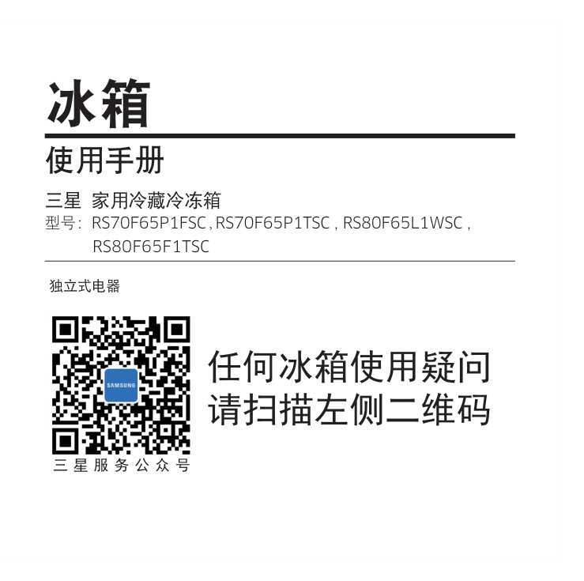

*图片展示了一本冰箱使用手册的封面页，整体为白色背景，黑色文字。顶部是大号加粗字体“冰箱”，下方有一条横线，接着是“使用手册”字样。再往下是产品信息，包括品牌“三星”、产品类型“家用冷藏冷冻箱”以及具体...*

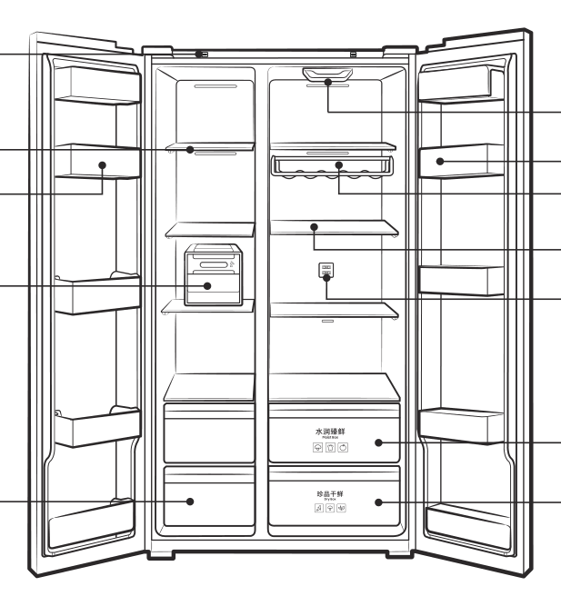

*这是一张冰箱内部结构的线稿示意图，展示了双开门冰箱的内部布局。冰箱左右两侧门均打开，内部包含多个隔层、抽屉和储物空间。左侧门内有多个可调节的搁架和一个底部的储物盒；右侧门内也有多个搁架和一个底部储物盒...*

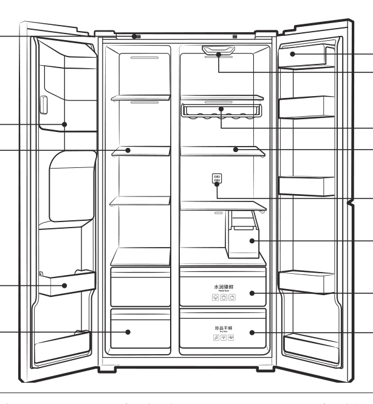

*这是一张冰箱内部结构的线稿示意图，展示了双开门冰箱的内部布局。冰箱左右两侧门均打开，左侧门内有多个储物格和一个抽屉式隔层，右侧门内也有多个水平搁架。冰箱主体部分分为上下两区：上部为冷藏室，设有多个可调...*

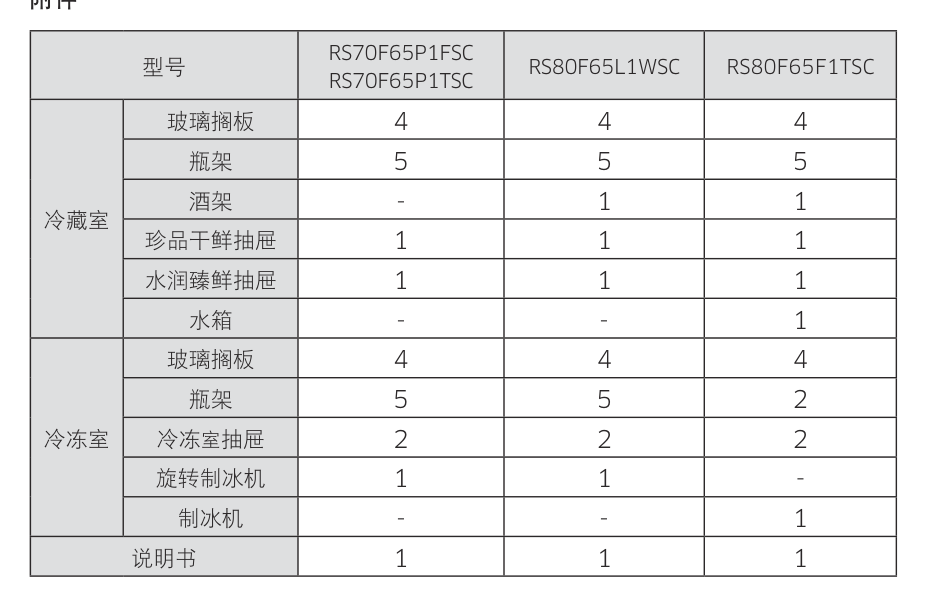

*这是一张表格，展示了三星冰箱不同型号（RS70F65P1FSC、RS70F65P1TSC、RS80F65L1WSC、RS80F65F1TSC）的内部配件配置情况。表格分为冷藏室和冷冻室两大部分，列出了...*

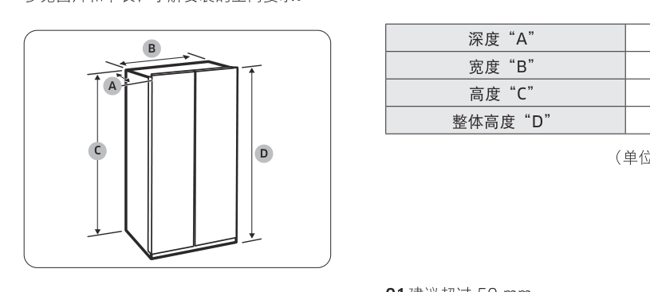

*图片展示了一个冰箱的三维示意图，标注了其主要尺寸参数。左侧为冰箱的立体结构图，用字母A、B、C、D分别标注了深度、宽度、高度和整体高度。右侧是一个表格，列出了对应的尺寸名称：深度“A”、宽度“B”、高...*

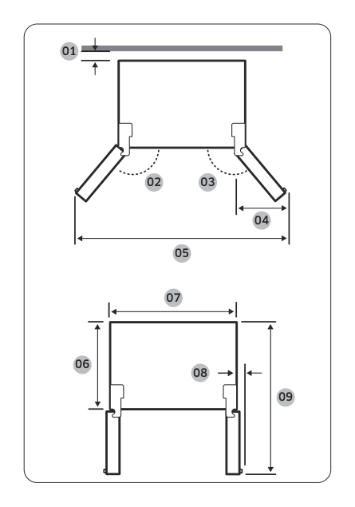

*图片展示了冰箱的两个视图示意图，上方为俯视图，下方为侧视图。每个视图中标注了多个尺寸和部件位置，用数字01至09进行标记。俯视图显示了冰箱顶部的结构，包括门铰链、内部隔板以及宽度（05）和深度（04）...*

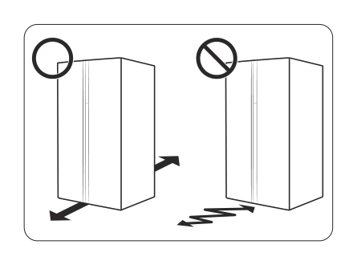

*图片展示了两个冰箱的示意图，左侧冰箱上方有一个圆圈标记，表示允许的操作，右侧冰箱上方有一个带斜线的圆圈标记，表示禁止的操作。左侧冰箱下方有两个箭头，分别指向左右两侧，表示可以水平移动；右侧冰箱下方有一...*

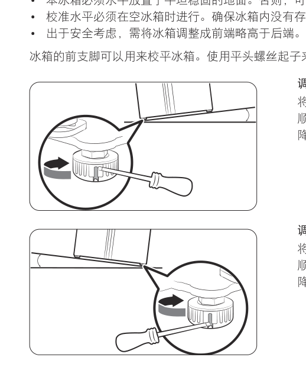

*图片包含两个示意图，展示了如何使用平头螺丝起子调整冰箱前支脚以校准冰箱水平。上方示意图显示顺时针旋转支脚使冰箱前端升高，下方示意图显示逆时针旋转支脚使冰箱前端降低。每个示意图中都有一个放大细节图，清晰...*

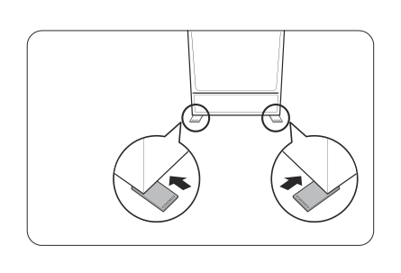

*这是一张示意图，展示了一个冰箱底部的结构细节。图中显示了冰箱底部的两个圆形区域，每个区域内部有一个灰色矩形块和一个指向该块的黑色箭头，表示某种部件或装置的位置和方向。两个圆形区域通过上方的连接结构与冰...*

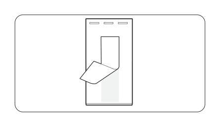

*图片展示了一个冰箱门的简化示意图，图中冰箱门呈竖直矩形，门上有一个长方形的区域代表门把手或面板，门的左侧有一部分向外翻开，表示门正在打开的状态。整体为黑白线条图，背景为白色，无颜色填充，布局简洁，用于...*

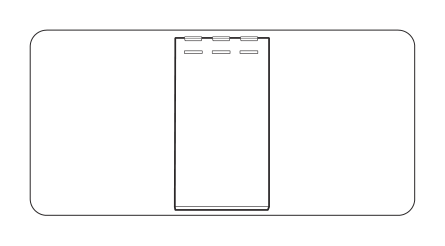

*图片展示了一个简洁的线条图，整体为一个横向的矩形框，内部中央有一个竖直的矩形结构，该结构顶部有三条短横线，可能代表按钮或指示灯。整个图形为黑白线条构成，无颜色填充，背景为白色。该图可能是某种设备（如冰...*

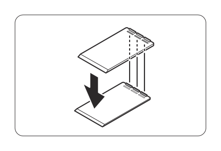

*图片展示了一个示意图，包含两个矩形板状物体，上方的板通过几条垂直虚线与下方的板相连，表示两者之间的对齐或连接关系。一个黑色箭头从上方板指向下方板，指示向下移动或安装的动作。整体为黑白线条图，背景为白色...*

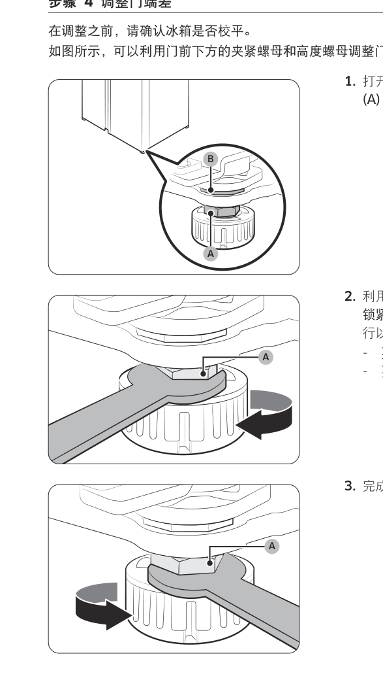

*图片展示了一组关于调整冰箱门端左的步骤示意图，包含三个分步图解。第一幅图显示了冰箱底部的夹紧螺母和高度螺母（标记为A和B），并用放大图突出显示调节部件。第二幅图展示了使用扳手顺时针旋转高度螺母（A）以...*

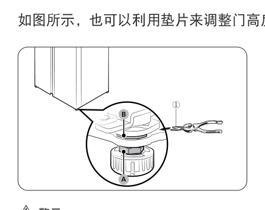

*这是一张示意图，展示了如何利用垫片调整冰箱门的高度。图中显示了一个冰箱门铰链的局部放大视图，其中包含一个带有螺纹的调节装置（标记为A）和一个垫片（标记为B）。使用钳子（标记为①）夹住垫片进行调整。图中...*

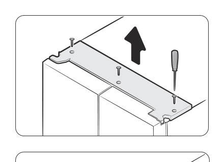

*这是一张示意图，展示了一个安装步骤。图中显示一个长条形金属板被固定在柜体顶部边缘，通过多个螺丝进行连接。金属板的一端有一个向上箭头，指示其应向上抬起或安装方向。旁边有一把螺丝刀，表示使用工具进行安装操...*

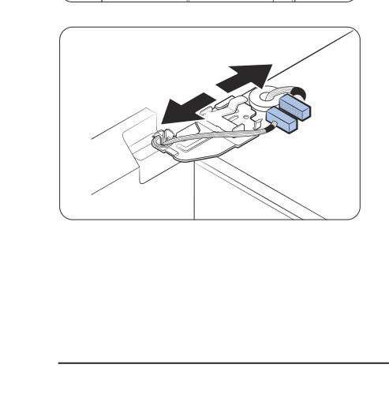

*这是一张示意图，展示了一个冰箱门铰链的拆卸过程。图中显示了冰箱门的一部分，以及连接在门上的铰链结构。有两个黑色箭头指向铰链部件，表示拆卸的方向。铰链上有一个蓝色的矩形部件，可能是用于固定或调节的零件。...*

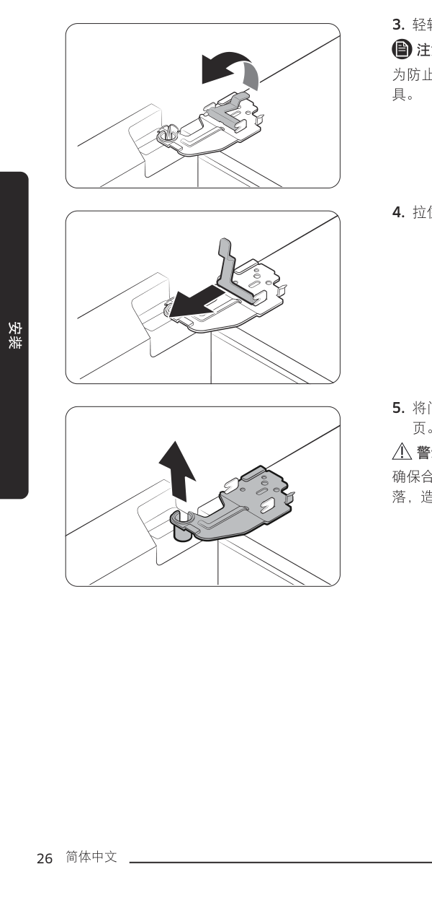

*图片展示了冰箱门铰链安装的三个步骤示意图，采用黑白线条图形式。左侧有竖排文字“安装”，右侧对应每个步骤有编号和说明文字。三个图示分别显示了铰链部件在安装过程中的旋转、插入和向上推入的动作，箭头指示操作...*

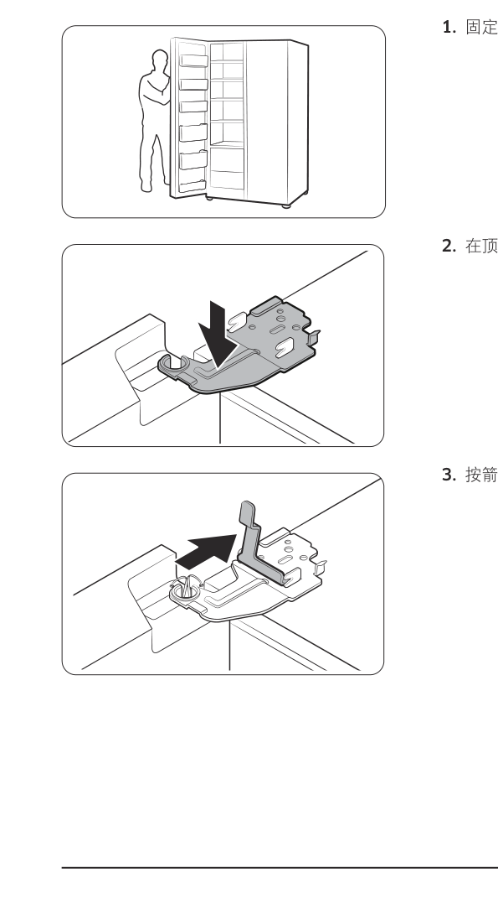

*图片展示了冰箱安装或拆卸门的三个步骤示意图。第一幅图显示一个人正在打开冰箱门，第二幅图展示了一个部件被向下按入冰箱顶部的安装位置，第三幅图则显示一个部件被向右推动以完成安装。整体为黑白线条图，包含箭头...*

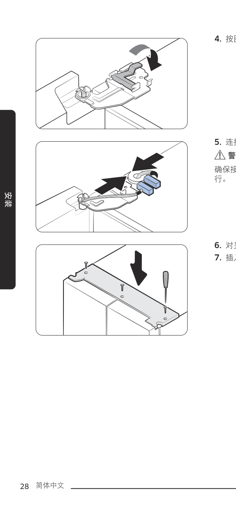

*图片展示了冰箱安装过程中的三个步骤示意图，采用黑白线条图形式。左侧有三个矩形框，每个框内包含一个安装步骤的图示：第一个图示显示将某个部件按压到位；第二个图示展示连接电线并用箭头指示方向；第三个图示显示...*

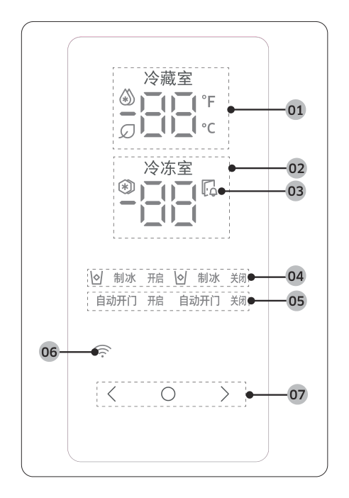

*这是一张冰箱控制面板的示意图，展示了其数字显示屏和功能按钮布局。面板分为上下两部分：上方显示冷藏室温度（8°C）和冷冻室温度（-18°C），分别带有水滴和雪花图标标识；下方是功能选项，包括制冰开启/关...*

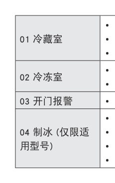

*图片展示了一个表格的一部分，包含四行内容，每行左侧为编号和中文功能名称，右侧为对应的点状标记。表格背景为浅灰色，文字为黑色，布局清晰，分为两列。左侧列列出冰箱的功能选项，包括冷藏室、冷冻室、开门报警和...*

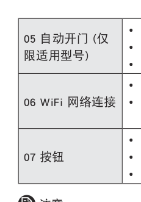

*图片显示了一个部分表格，包含三个条目，每个条目左侧为编号和功能描述，右侧为对应的点状标记。表格背景为浅灰色，文字为黑色，布局清晰，分为两列。第一列为功能编号和名称，第二列为点状符号，可能用于指示选项或...*

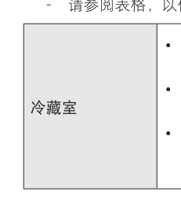

*图片显示了一个表格的一部分，左侧是一个灰色矩形框，内有文字“冷藏室”，右侧是三个点状符号，可能表示列表项或待填写内容。整体布局简洁，颜色为灰白配色，属于文档中的表格结构。...*

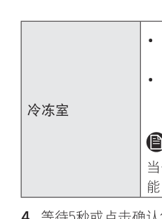

*图片展示了一个冰箱内部结构的示意图，左侧为一个灰色矩形区域，标注有“冷冻室”字样，表示冰箱的冷冻部分。右侧有一条竖直的黑色线条，旁边有一个小圆点和一个图标，图标下方有文字“当能”，可能表示某种功能或状...*

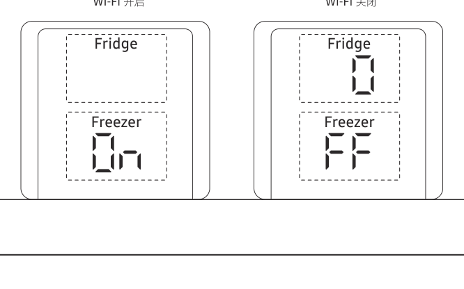

*图片展示了冰箱显示屏在Wi-Fi开启和关闭两种状态下的显示界面。左侧为Wi-Fi开启状态，显示‘Fridge’和‘Freezer’区域，其中Freezer显示温度为0°C；右侧为Wi-Fi关闭状态，F...*

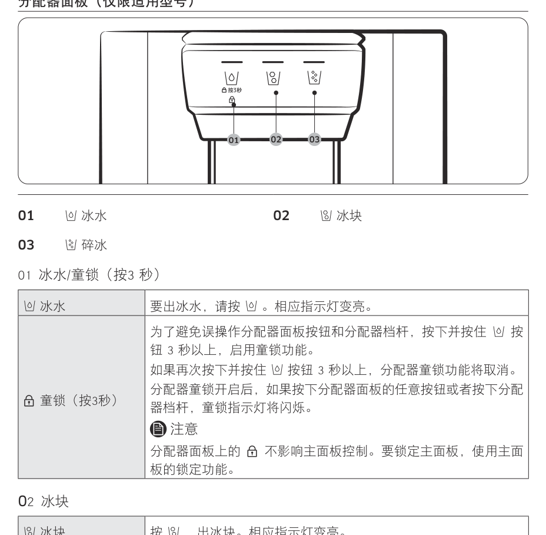

*图片展示了一款冰箱分配器面板的示意图，包含三个按钮及其功能说明。图中上方为分配器面板的线框图，标注了三个按钮的位置：01为冰水按钮（带锁图标），02为冰块按钮，03为碎冰按钮。下方是对应按钮的功能说明...*

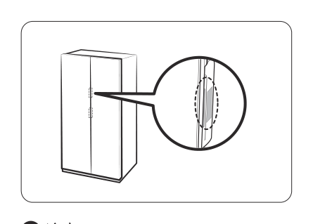

*这是一张黑白线条示意图，展示了一个冰箱的侧面视图，重点突出其门缝结构。图中左侧是一个简化绘制的冰箱外形，右侧通过一个放大镜式圆形区域对冰箱门边缘的密封结构进行特写，显示了门封条的细节和内部构造。放大区...*

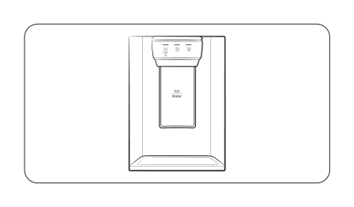

*这是一张黑白线条图，展示了一个冰箱的饮水分配器面板的示意图。图中显示了饮水机的正面结构，包括顶部的控制按钮区域（有三个按钮），中间的出水口区域，以及下方标有“ICE Water”的字样，表示可以提供冰...*

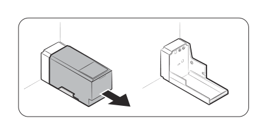

*图片展示了两个三维示意图，左侧是一个灰色的矩形设备（可能是冰箱的压缩机或某个组件），右侧是一个带有凹槽和接口的白色部件。两者之间有一个黑色箭头指向右侧部件，表示将左侧部件插入或安装到右侧部件中。整体布...*

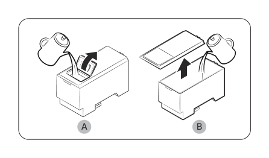

*图片展示了两个步骤的示意图，用于说明冰箱的安装或使用过程。图A显示一个水壶向冰箱顶部的开口倒入液体，箭头指示液体流入方向；图B显示冰箱顶部盖板被打开，水壶继续向内部倒入液体，箭头同样指示流动方向。两个...*

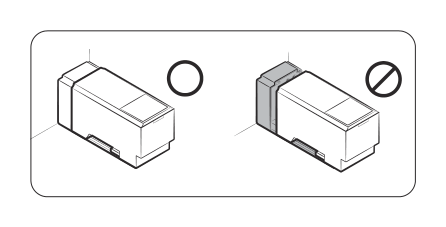

*图片展示了两个冰箱的示意图，左侧为正确安装方式，右侧为错误安装方式。左侧冰箱底部有支撑脚，且上方有一个空心圆圈表示允许；右侧冰箱底部被垫高，且上方有一个带斜线的圆圈表示禁止。整体为黑白线条图，背景为白...*

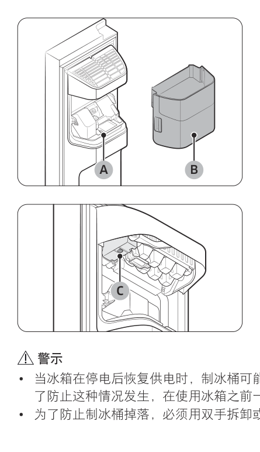

*图片包含两幅示意图，上方图展示了冰箱制冰桶的安装位置和拆卸方式，其中A标记为冰箱内部的制冰装置区域，B标记为可拆卸的制冰桶。下方图展示了制冰桶在冰箱内部的具体结构，C标记为制冰桶的固定位置。图中使用线...*

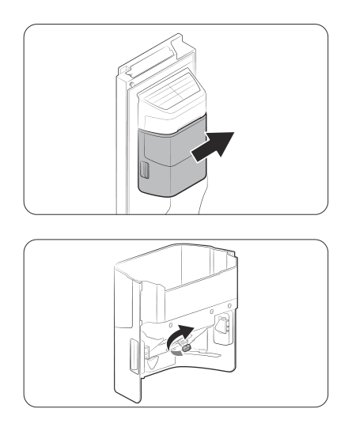

*图片包含两个示意图，展示了冰箱门的拆卸步骤。上图显示了冰箱门的一部分，有一个灰色的部件被箭头指向右侧，表示将其向右拉出。下图展示了冰箱门内部结构，一个黑色箭头指示将内部的一个部件逆时针旋转或拨动，以完...*

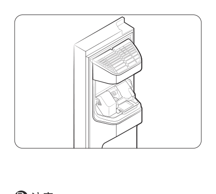

*这是一张冰箱内部结构的线稿示意图，展示了冰箱门打开后的内部布局。图中可见冰箱门内侧设有多个储物格，包括上部的抽屉式储物盒和下部的瓶装饮料存放区。整体采用简洁的黑白线条绘制，突出结构细节，无颜色填充。图...*

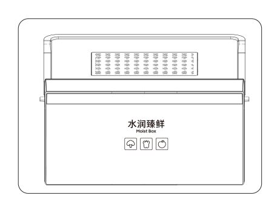

*这是一张冰箱内部抽屉的示意图，展示了一个带有标签的储物盒。图中显示一个矩形抽屉，上方有一个带网格状结构的区域，可能是用于通风或湿度控制的装置。抽屉正面中央标有中文“水润臻鲜”和英文“Moist Box...*

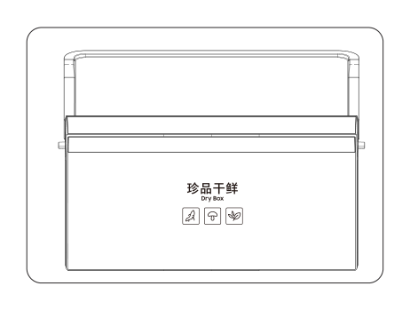

*这是一张冰箱内部抽屉的线框示意图，展示了一个带有标签的抽屉结构。抽屉呈矩形，上方有一个可滑动的盖板，整体设计简洁。抽屉正面中央标有中文“珍品干鲜”和英文“Dry Box”，下方有三个图标，分别代表肉类...*

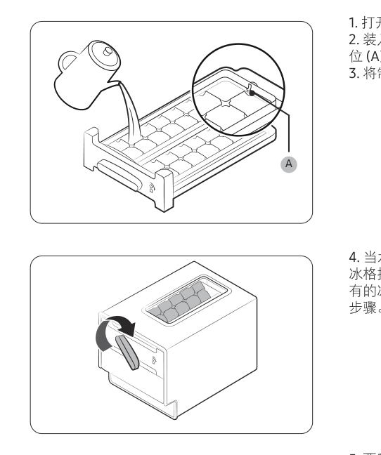

*图片包含两个示意图，展示了制作冰块的步骤。上方图示显示一个水壶向冰格中倒水，冰格被放置在一个托盘上，右上角有一个放大细节图，标注了位置A，可能表示排水孔或特定结构。下方图示展示了一个冰格装置被放入冰箱...*

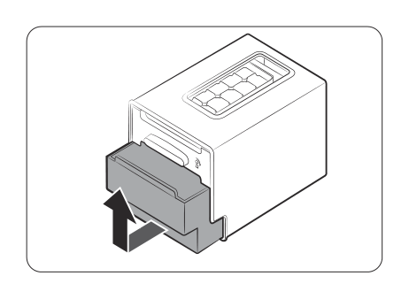

*这是一张黑白线条示意图，展示了一个冰箱的局部结构。图中显示冰箱的底部有一个可拉出的抽屉式部件，该部件被部分拉出，并用一个黑色箭头指示其拉出方向。冰箱主体呈立方体形状，顶部有格栅状设计，侧面有把手和标识...*

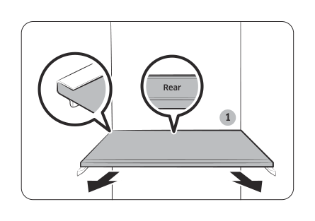

*这是一张示意图，展示了一个冰箱底部的安装或调整步骤。图中显示一个灰色的矩形平面（代表冰箱底部），下方有两个黑色箭头指向左右两侧，表示需要向两侧推动或调整。在冰箱底部上方有两个放大细节图：左侧的圆形放大...*

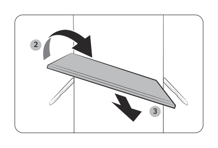

*这是一张示意图，展示了一个矩形板状物体（可能是冰箱的底座或部件）在两个支撑点之间的倾斜和移动过程。图中包含一个灰色的矩形板，两端由白色线条表示的支撑物支撑。左侧有一个标号为2的灰色箭头，表示逆时针旋转...*

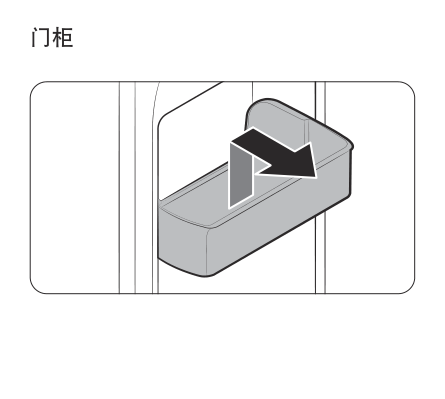

*图片展示了一个门柜的示意图，图中有一个灰色的长方体容器，位于一个门框结构内。容器内部有一个黑色箭头，指向右侧，表示物品或部件应向右滑动或插入的方向。整体为简洁的线条和灰度配色，用于说明门柜的使用方式或...*

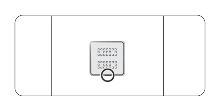

*图片展示了一个矩形框，内部被两条竖线分为三个部分。中间部分有一个方形的面板，面板上排列着多个小圆点，形成网格状布局，下方有一个圆形按钮，被黑色圆圈突出显示。整体为黑白线条图，无颜色，风格简洁，用于示意...*

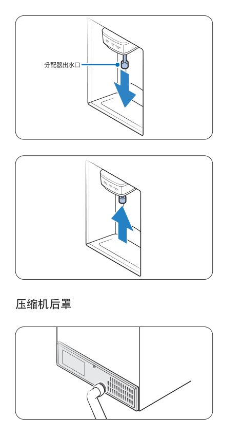

*图片由三个独立的示意图组成，展示了冰箱的部分结构和操作步骤。第一幅图显示了冰箱分配器出水口的位置，并用蓝色箭头指示水流方向向下；第二幅图展示了水流向上进入分配器的过程，同样用蓝色箭头表示；第三幅图标注...*

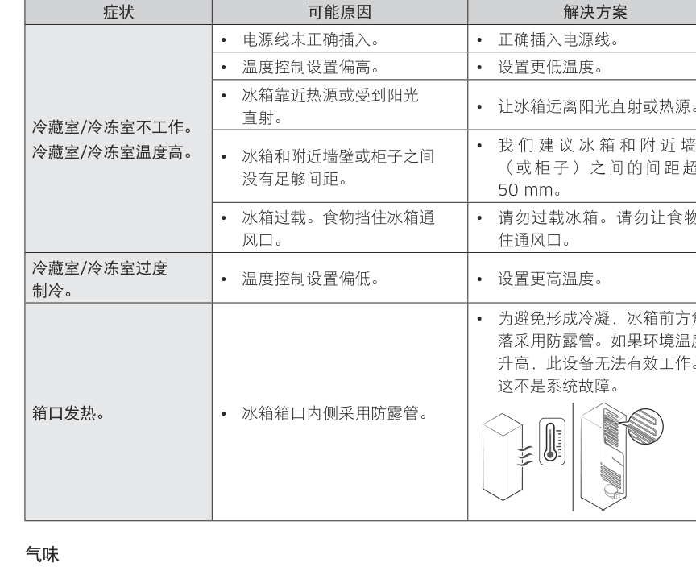

*图片展示了一张冰箱使用手册中的故障排除表格，分为三列：症状、可能原因和解决方案。表格内容包括冷藏室/冷冻室不工作、温度过高、过度制冷以及箱口发热等问题的排查方法。右侧包含两个示意图，分别表示冰箱散热和...*

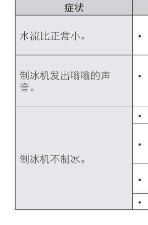

*图片展示了一个表格的一部分，表格分为两列。左侧列包含症状描述，右侧列为空白，仅在对应行中显示一个黑点（•），可能用于标记或填写原因。表格背景为浅灰色，文字为黑色，字体清晰。表格中的症状包括：'水流比正...*

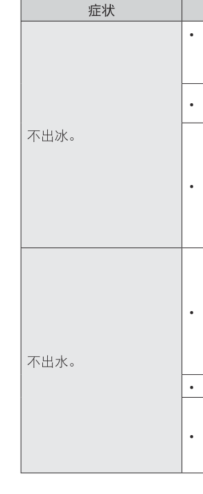

*图片展示了一个表格的一部分，表格分为两列。左侧列包含两个单元格，分别写着‘不出冰。’和‘不出水。’，右侧列对应每个单元格有三个点（•），可能表示待填写的项目或选项。表格背景为浅灰色，文字为黑色，整体布...*

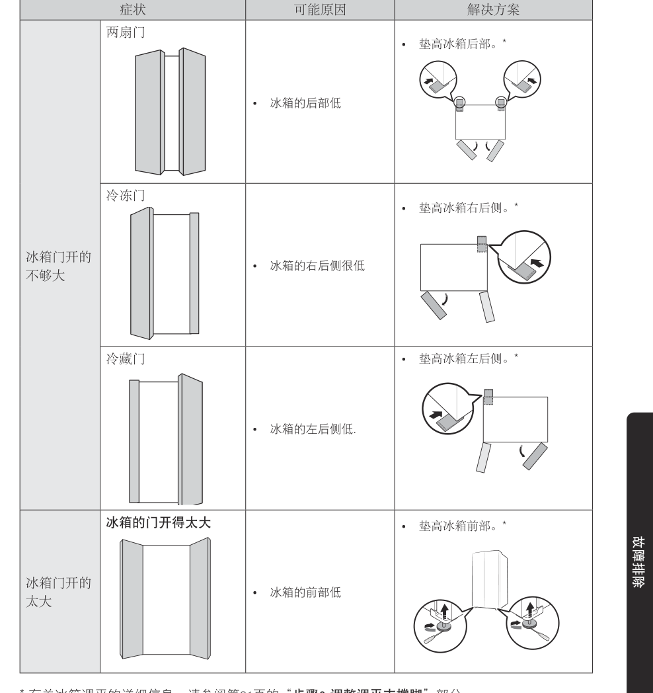

*这是一张关于冰箱门开启问题的故障排除表格，分为三列：症状、可能原因和解决方案。表格左侧列出两种主要症状：'冰箱门开的不够大' 和 '冰箱的门开得太大'。每种症状下有对应的图示说明，例如两扇门、冷冻门、...*

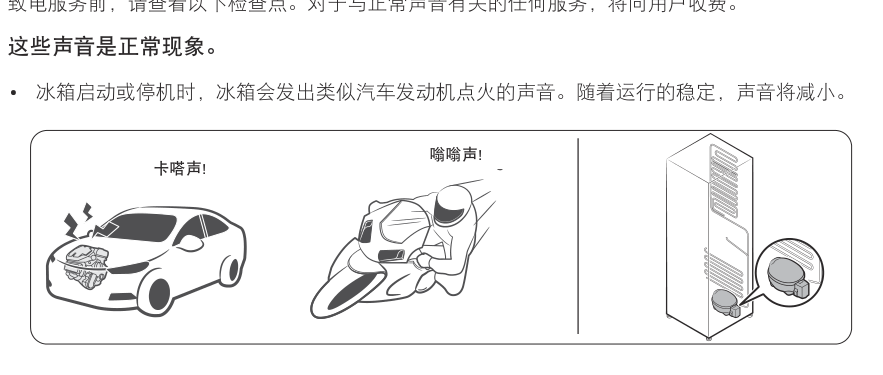

*图片包含三个并列的插图，左侧是一辆汽车，引擎盖打开，发动机部分有震动线条和‘卡嗒声！’的文字标注；中间是一辆摩托车，骑手正在驾驶，车体周围有速度线，上方标注‘嗡嗡声！’；右侧是一个冰箱的侧面示意图，底...*

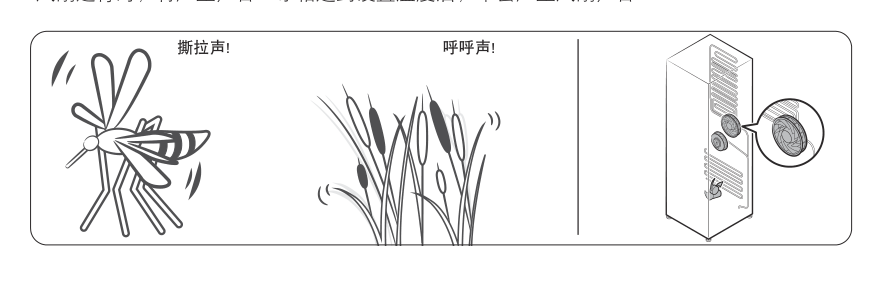

*图片分为三个部分，从左到右依次展示：第一部分是一只蚊子正在飞行，旁边有‘撕拉声！’的文字，表示蚊子飞行时发出的声音；第二部分是芦苇丛，旁边有‘呼呼声！’的文字，表示风吹过芦苇时发出的声音；第三部分是一...*

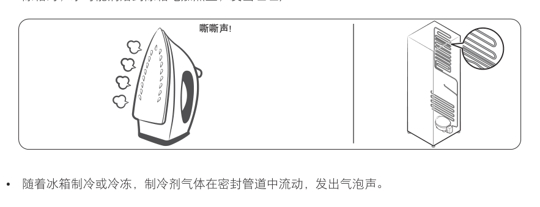

*图片分为左右两个部分，左侧是一个电熨斗的示意图，上方标有“嘶嘶声！”字样，电熨斗周围有多个蒸汽云状图案，表示正在发出蒸汽声。右侧是一个冰箱的侧面结构示意图，展示了内部制冷管道的布局，其中有一个放大细节...*

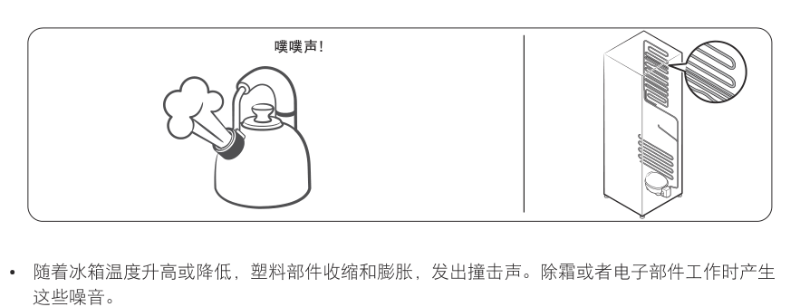

*图片分为左右两部分，左侧是一个正在发出蒸汽的水壶示意图，上方标注有“噗噗声！”字样，表示声音；右侧是一个冰箱的侧面示意图，放大了冰箱背面的散热器部分，显示其内部结构。整体为黑白线条图，无颜色，用于说明...*

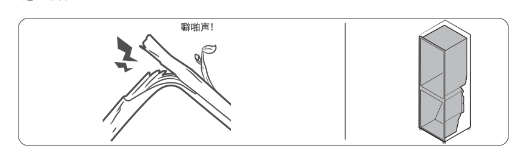

*图片分为左右两部分，左侧展示了一根树枝断裂的示意图，伴有闪电状符号和文字“噼啪声！”，表示发出声音的瞬间；右侧是一个冰箱内部结构的示意图，显示了冰箱内壁出现裂缝或破损的情况。整体为黑白线条图，无颜色，...*

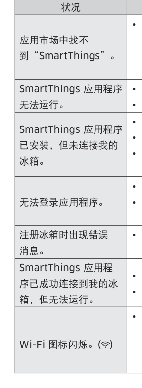

*图片展示了一个表格，左侧列出了与三星冰箱SmartThings功能相关的多种使用状况或问题，右侧对应每个状况留有空白点，可能用于用户勾选或填写。表格背景为浅灰色，文字为黑色，布局清晰，分为两列：左列为...*

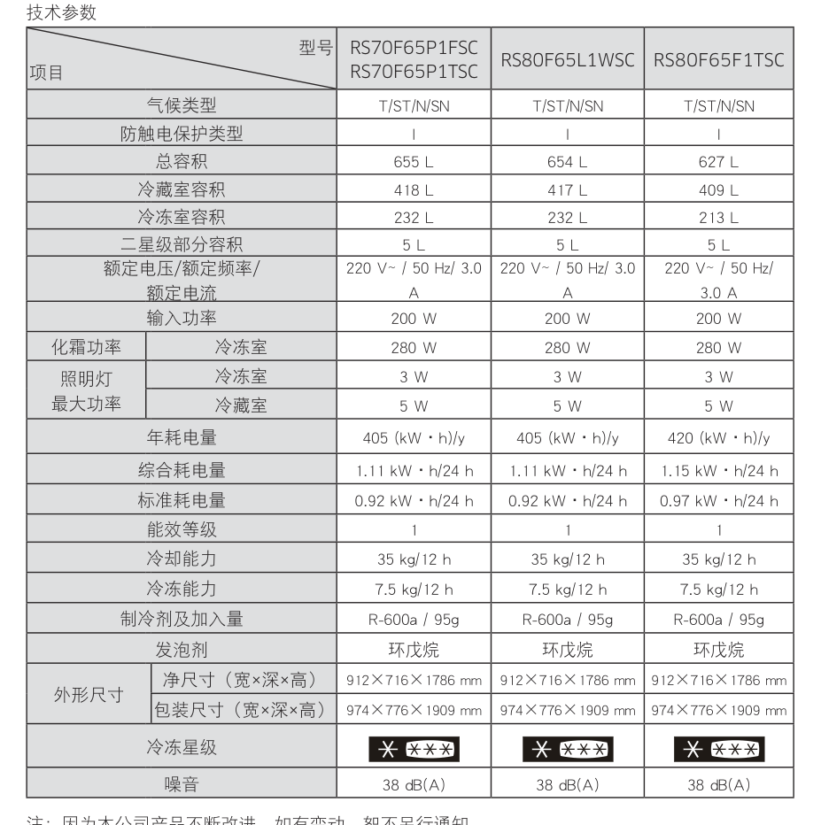

*这是一张技术参数表格，展示了三星家用冷藏冷冻箱三种型号（RS70F65P1FSC、RS70F65P1TSC、RS80F65L1WSC、RS80F65F1TSC）的详细规格信息。表格以横向列形式列出不同...*

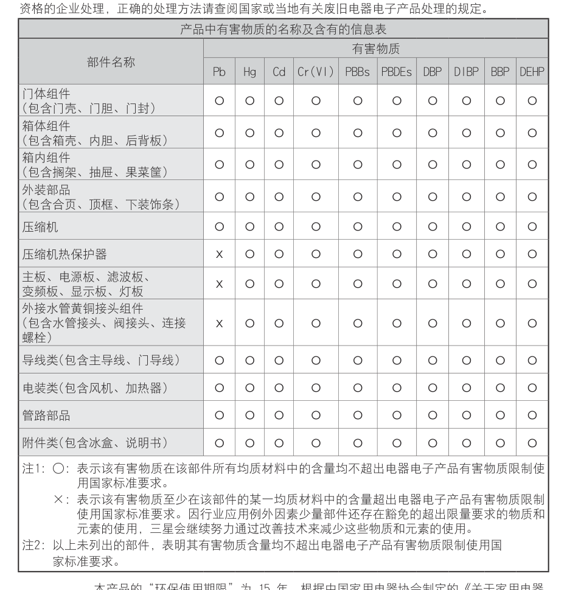

*图片展示了一张表格，标题为“产品中有害物质的名称及含有的信息表”。表格列出了不同部件名称及其所含的有害物质情况，包括铅（Pb）、汞（Hg）、镉（Cd）、六价铬（Cr(VI)）、多溴联苯（PBBs）、多...*

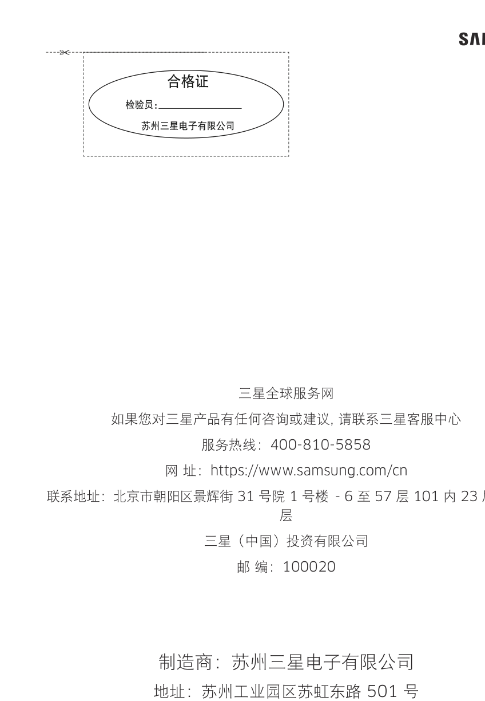

*图片展示了一张合格证的页面，整体为白色背景，黑色文字。页面上方有一个椭圆形框，内写有“合格证”字样，下方有“检验员：”的空白填写栏和“苏州三星电子有限公司”的字样。该椭圆框被虚线矩形包围，左上角标有“...*

---

